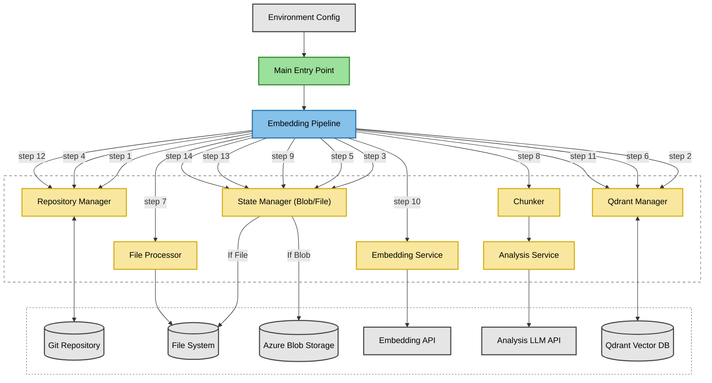

# Embedder

This project provides a configurable pipeline to process files within a Git repository, analyse code using a Language Model (LLM), chunk the content intelligently, generate text embeddings, and store them in a Qdrant vector database. It keeps track of processed files and Git commits to efficiently update the embeddings when the repository changes.

## Features
*   **Git Integration:** Operates on files tracked within a Git repository.
*   **Differential Updates:** Processes only files that have changed (`A`dded, `M`odified, `D`eleted, `R`enamed, `C`opied) since a specific base commit. This base commit is determined by:
    *   The `DIFF_FROM_COMMIT` environment variable, if set (takes highest priority).
    *   The `lastProcessedCommit` stored in the state file, if `DIFF_ONLY=true` is set and `DIFF_FROM_COMMIT` is not.
    *   If neither `DIFF_FROM_COMMIT` is set nor `DIFF_ONLY=true`, a full scan of all tracked files is performed.
    *   The pipeline attempts to fetch full Git history (`git fetch --depth=0`) if the specified `DIFF_FROM_COMMIT` is not found locally. An error occurs if the commit remains invalid after fetching.
*   **State Management:** Persists the mapping between files and their corresponding Qdrant point IDs, along with the `lastProcessedCommit` hash representing the repository state successfully processed in the *previous* run. Supports two modes configured via `STATE_MANAGER_TYPE`:
    *   **Azure Blob Storage (`blob`):** Stores state in a specified Azure Blob Storage container.
    *   **Local File System (`file`):** Stores state in a local JSON file specified by `STATE_FILE_PATH`.
*   **LLM-Powered Code Analysis:** Uses a configurable LLM (e.g., Azure OpenAI) via the AI SDK to analyse code files, extracting:
*   **LLM-Powered Code Analysis:** Uses a configurable LLM (e.g., Azure OpenAI) via the AI SDK to analyse code files, extracting:
    *   Overall summary
    *   Relevant tags (keywords, concepts, frameworks)
    *   Structural elements (imports, exports, classes, functions, interfaces)
    *   This analysis is added as metadata to the generated chunks.
    *   **Analysis Caching:** Caches successful analysis results locally (`.analysis_cache/`) based on file content hash. Avoids re-analyzing unchanged files on subsequent runs, improving performance and resilience to interruptions.
 *   **Intelligent Chunking:** Employs file-type specific chunking strategies using the `@mastra/rag` library:
    *   Recognizes Code, HTML, JSON, Markdown, and generic Text files.
    *   Uses appropriate strategies (e.g., recursive for code, HTML-aware for HTML).
    *   Chunking parameters (size, overlap) are configurable via environment variables (defaults provided).
    *   Includes LLM analysis results in the metadata of each chunk.
*   **Embedding Generation:** Uses a configurable embedding model via the AI SDK (`@ai-sdk/openai-compatible` or others) to generate vector embeddings for each text chunk. Supports batching, configurable delays, and retries.
*   **Vector Storage (Qdrant):**
    *   Connects to a Qdrant instance.
    *   Ensures the specified collection exists with the correct vector dimensions and distance metric.
    *   **On collection creation, automatically creates payload indices** for key metadata fields (`source`, `tags`, `analysisError`) to enable efficient filtering during queries.
    *   Upserts new embeddings and metadata in batches.
    *   Deletes points associated with changed or deleted files before upserting new ones.
    *   Includes retry logic for Qdrant operations.
*   **Concurrency Control:** Uses `p-limit` to manage concurrency during the file chunking phase.
*   **Configuration:** Primarily configured via environment variables (`.env` file).
*   **Robust Error Handling:** Includes retries for network operations (LLM analysis, embedding, Qdrant) and detailed logging.

## Architecture / Workflow



The `EmbeddingPipeline` orchestrates the entire process by executing a sequence of steps, coordinating different components. The diagram above visually represents this flow. The steps correspond directly to the numbered comments within the `EmbeddingPipeline.run()` method:

1.  **Check Repository:** The `RepositoryManager` verifies that the target directory is a valid Git repository root. *(Initial check)*
2.  **Ensure Qdrant Collection:** The `QdrantManager` checks if the target collection exists in Qdrant. If not, it creates the collection along with necessary payload indices (`source`, `tags`, `analysisError`). It also validates vector dimensions and distance metric compatibility if the collection already exists.
3.  **Load State:** The configured `StateManager` (either `BlobStateManager` or `FileStateManager`) reads the state from its source (Azure Blob or local file). If the source doesn't exist, it starts with an empty state. It loads the last processed Git commit hash, the mapping of previously processed files to their Qdrant point IDs, and any `pendingChunks` from a previous incomplete run.
4.  **List Files:** The `RepositoryManager` determines which files need processing. It identifies a base commit for comparison: the `DIFF_FROM_COMMIT` environment variable (if set), otherwise the `lastProcessedCommit` from the loaded state (if `DIFF_ONLY=true`), otherwise it prepares for a full scan. If using a specific commit, it ensures the commit exists locally (fetching full history if needed) and then performs a `git diff` from that base commit to `HEAD`. If performing a full scan, it uses `git ls-files`. It outputs sets of `filesToProcess` and `filesToDeletePointsFor`.
5.  **Identify Points for Deletion:** The `StateManager` uses the loaded state and the `filesToDeletePointsFor` set (determined in the previous step based on diff results or full scan logic) to compile a list of specific Qdrant point IDs that correspond to outdated file versions or deleted files.
6.  **Delete Outdated Points:** The `QdrantManager` sends a request to Qdrant to delete the points identified in the previous step. This cleanup happens before adding new data.
7.  **Filter & Load Files:** The `FileProcessor` takes the `filesToProcess` set, filters out non-text files (binaries, lock files), reads the content of valid text files, and determines the appropriate chunking strategy (`code`, `html`, etc.) for each.
8.  **Analyze & Chunk Files:** The `Chunker` processes the valid files concurrently. For each file, it uses the `AnalysisService` to get LLM-generated metadata (checking a local cache first based on file content hash) and then chunks the content using the appropriate strategy (`@mastra/rag`), embedding the analysis results into the chunk metadata. If analysis is performed (cache miss or stale), the result is cached. Configured delays (`SUMMARY_API_DELAY_MS`) are applied between analysis calls. It then combines these newly generated chunks with any `pendingChunks` loaded from the previous state.
9.  **Save Intermediate State:** The `StateManager` saves an *intermediate state* to its configured destination. This state includes all combined chunks (pending + new) marked as `pendingChunks`, along with the current commit hash and the results of the point deletions from Step 6. This allows the pipeline to resume from this point if the subsequent embedding or upsert steps fail.
10. **Generate Embeddings:** The `EmbeddingService` takes the combined list of text chunks, batches them, and calls the configured Embedding API (with delays `EMBEDDING_API_DELAY_MS` and retries) to generate vector embeddings for each chunk.
11. **Upsert New Points:** The `QdrantManager` prepares Qdrant point objects (ID, vector, payload) for the new chunks and upserts them into the Qdrant collection in batches, waiting for completion.
12. **Get Current Commit:** The `RepositoryManager` retrieves the current `HEAD` commit hash from the Git repository (this might be the same as the one saved in the intermediate state, but retrieved again for consistency).
13. **Calculate *Final* State:** The `StateManager` computes the *final* state based on the *intermediate state* saved in Step 9. It updates the `files` mapping with the `newFilePointsState` (mapping files to their newly upserted point IDs) and clears the `pendingChunks` field (as they are now successfully processed). The current commit hash is also included.
14. **Save *Final* State:** The `StateManager` saves the calculated *final* state (as JSON) to its configured destination (Azure Blob or local file), overwriting the intermediate state.
13. **Save *Final* State:** The `StateManager` saves the calculated *final* state (as JSON) to its configured destination (Azure Blob or local file), overwriting the intermediate state.

## Setup

1.  **Prerequisites:**
    *   Node.js (v18 or later recommended)
    *   Git
    *   Access to a running Qdrant instance.
    *   Access to an OpenAI-compatible Embedding API endpoint (e.g., OpenAI API, LM Studio, Ollama with OpenAI compatibility).
    *   Access to an Azure OpenAI endpoint for the Code Analysis LLM.
    *   An Azure Storage Account (Blob Storage) *if* using `STATE_MANAGER_TYPE=blob`.

2.  **Install Dependencies:**
    ```bash
    npm install # Installs all dependencies, including @azure/storage-blob
    ```

3.  **Create `.env` file:**
    Copy `.env.example` to `.env` and fill in the required values:

    ```dotenv
    # --- State Management ---
    # Choose 'blob' or 'file'. Default is 'blob' if omitted.
    # STATE_MANAGER_TYPE=blob
    STATE_MANAGER_TYPE=file

    # --- Azure Blob Storage Settings (Required if STATE_MANAGER_TYPE=blob) ---
    # Connection string for your Azure Storage account (get from Azure Portal)
    # IMPORTANT: Keep this secure, do not commit directly (use .env and add to .gitignore, which should also include .analysis_cache/)
    AZURE_STORAGE_CONNECTION_STRING="DefaultEndpointsProtocol=https;AccountName=your_storage_account_name;AccountKey=your_storage_account_key;EndpointSuffix=core.windows.net"
    # Name of the container to store the state file in (will be created if it doesn't exist)
    AZURE_STORAGE_CONTAINER_NAME="embedding-state-container"
    # Name of the blob file within the container
    AZURE_STORAGE_BLOB_NAME="repository-embedding-state.json" # e.g., project-state.json

    # --- File System Settings (Required if STATE_MANAGER_TYPE=file) ---
    # Path to the state file (relative to project root or absolute). Directory will be created.
    STATE_FILE_PATH="./.embedder/state.json" # e.g., ./data/project-state.json

    # --- Target Repository ---
    # Base directory of the Git repository to process (optional, defaults to current dir)
    # BASE_DIR=/path/to/your/project

    # --- Processing Mode ---
    # Set to true to only process files changed since the last run (based on state)
    # Set to false or omit to process all tracked files on every run.
    DIFF_ONLY=true
    # Optional: Specify a commit hash to diff against, overriding DIFF_ONLY and the state file's last commit.
    # If set, the pipeline will attempt to fetch full history if the commit isn't local.
    # The run will FAIL if the commit is invalid or cannot be found after fetching.
    # DIFF_FROM_COMMIT=your_commit_hash_here

    # --- Embedding Model Configuration (OpenAI-Compatible) ---
    EMBEDDING_PROVIDER_NAME=openai # Or 'lmstudio', 'ollama', etc.
    EMBEDDING_PROVIDER_BASE_URL=https://api.openai.com/v1 # Or http://localhost:1234/v1 etc.
    EMBEDDING_PROVIDER_API_KEY=sk-your_openai_key # Optional, needed for cloud providers
    EMBEDDING_MODEL=text-embedding-3-small # Model name compatible with the provider
    EMBEDDING_DIMENSIONS=1536 # MUST match the output dimension of the embedding model
    EMBEDDING_BATCH_SIZE=96 # Number of texts to embed per API call (optional, default 96)
    EMBEDDING_API_DELAY_MS=50 # Delay between embedding API batches (ms) (optional, default 1000ms)

    # --- Code Analysis LLM Configuration (Azure OpenAI) ---
    SUMMARY_RESOURCE_NAME=your_azure_resource_name # Azure OpenAI resource name
    SUMMARY_DEPLOYMENT=your_gpt4_deployment_id # Deployment ID (e.g., gpt-4o)
    SUMMARY_API_VERSION=2024-12-01-preview
    SUMMARY_API_KEY=your_azure_api_key # Azure OpenAI API Key
    SUMMARY_API_DELAY_MS=1000 # Delay after each analysis call (ms) - useful for rate limiting (optional, default 1000ms)

    # --- Qdrant Configuration ---
    QDRANT_HOST=localhost: # Host of your Qdrant instance
    QDRANT_PORT=6333 # Port of your Qdrant instance
    QDRANT_API_KEY= # Optional Qdrant API Key if authentication is enabled
    QDRANT_COLLECTION_NAME=my_code_embeddings # Name for the Qdrant collection
    # QDRANT_USE_HTTPS=false # Set to true if Qdrant uses HTTPS (optional, default false)
    DISTANCE_METRIC=Cosine # Or Euclid, Dot (optional, default Cosine) - Must match collection if it exists
    UPSERT_BATCH_SIZE=100 # Points per Qdrant upsert batch (optional, default 100)
    DELETE_BATCH_SIZE=200 # Points per Qdrant delete batch (optional, default 200)

    # --- Chunking & Concurrency Configuration ---
    DEFAULT_CHUNK_SIZE=512 # Fallback chunk size for recursive strategy (optional, default 512)
    DEFAULT_CHUNK_OVERLAP=50 # Fallback chunk overlap for recursive strategy (optional, default 50)
    MAX_CONCURRENT_CHUNKING=5 # Max files to chunk simultaneously (optional, default 5)

    # Add custom chunking options here if needed (see TODO in main.ts)
    # e.g., CHUNK_OPTIONS_TEXT_SIZE=1000
    ```

## Usage

1.  **Build the project (optional but recommended):**
    ```bash
    npm run build
    ```

2.  **Run the pipeline:**

    *   Using the compiled JavaScript (after `npm run build`):
        ```bash
        node dist/main.js
        ```
    *   Or run directly using `tsx`:
        ```bash
        npx tsx src/main.ts
        ```

3.  **Output:**
    *   The script logs progress messages to the console.
    *   Upon successful completion, the Qdrant collection (`QDRANT_COLLECTION_NAME`) will contain embeddings for the processed files.
    *   The state information (mapping files to Qdrant points and the last commit hash) will be saved to the configured destination (Azure Blob or local file).

## Code Structure (`src/`)

*   **`main.ts`**: Entry point, configuration loading, service initialization, pipeline execution.
*   **`embeddingPipeline.ts`**: Orchestrates the overall workflow, coordinating different managers and services.
*   **`embeddingPipelineOptions.ts`**: Defines the configuration and dependencies needed by the pipeline.
*   **`repositoryManager.ts`**: Handles Git interactions (checking repo, getting commit, listing changed/all files).
*   **`stateManager.ts`**: Defines the `StateManager` interface and `FilePointsState` type.
*   **`blobStateManager.ts`**: Implements `StateManager` using Azure Blob Storage.
*   **`fileStateManager.ts`**: Implements `StateManager` using the local file system.
*   **`fileProcessor.ts`**: Filters candidate files, reads content, determines chunking strategy.
*   **`analysisService.ts`**: Interacts with the LLM to perform code analysis, including caching results locally to avoid redundant API calls for unchanged files.
*   **`codeFileAnalysisSchema.ts`**: Defines the Zod schema for the expected LLM analysis output.
*   **`chunker.ts`**: Chunks file content using `@mastra/rag`, incorporating analysis results.
*   **`chunkOptions.ts` / `fileTypeChunkingOptions.ts` / `chunkStrategy.ts`**: Define types and defaults for chunking configuration.
*   **`embeddingService.ts`**: Generates text embeddings using the configured AI model (batching, retries).
*   **`qdrantManager.ts`**: Handles all interactions with the Qdrant vector database (collection management, upserts, deletes, retries).
*   **`retry.ts` / `retryOptions.ts`**: Provides a generic async retry mechanism with exponential backoff.
*   **`utilities.ts`**: Helper functions for file system checks and type detection.
*   **`chunk.ts`**: Defines the structure of a text chunk with metadata.