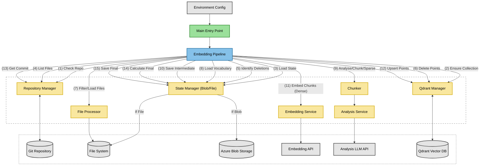

This file is a merged representation of the entire codebase, combined into a single document by Repomix.

# File Summary

## Purpose
This file contains a packed representation of the entire repository's contents.
It is designed to be easily consumable by AI systems for analysis, code review,
or other automated processes.

## File Format
The content is organized as follows:
1. This summary section
2. Repository information
3. Directory structure
4. Multiple file entries, each consisting of:
  a. A header with the file path (## File: path/to/file)
  b. The full contents of the file in a code block

## Usage Guidelines
- This file should be treated as read-only. Any changes should be made to the
  original repository files, not this packed version.
- When processing this file, use the file path to distinguish
  between different files in the repository.
- Be aware that this file may contain sensitive information. Handle it with
  the same level of security as you would the original repository.

## Notes
- Some files may have been excluded based on .gitignore rules and Repomix's configuration
- Binary files are not included in this packed representation. Please refer to the Repository Structure section for a complete list of file paths, including binary files
- Files matching patterns in .gitignore are excluded
- Files matching default ignore patterns are excluded
- Files are sorted by Git change count (files with more changes are at the bottom)

## Additional Info

# Directory Structure
```
src/
  analysisService.ts
  blobStateManager.ts
  chunk.ts
  chunker.ts
  chunkOptions.ts
  chunkStrategy.ts
  codeTokenizer.ts
  embeddingPipeline.ts
  embeddingPipelineOptions.ts
  embeddingService.ts
  fileProcessor.ts
  fileStateManager.ts
  fileTypeChunkingOptions.ts
  main.ts
  qdrantManager.ts
  rateLimiter.ts
  repositoryManager.ts
  retry.ts
  retryOptions.ts
  stateManager.ts
  utilities.ts
  vocabularyBuilder.ts
.env.example
.gitignore
package.json
README.md
tsconfig.json
```

# Files

## File: src/chunkOptions.ts
````typescript
import { ChunkStrategy } from "./chunkStrategy.js";

/**
 * Defines the configuration options for a specific chunking strategy.
 * These options are used internally and then mapped to the options
 * expected by the @mastra/rag library.
 */
export interface ChunkingOptions {
  /** The chunking strategy to use (e.g., 'recursive', 'html'). */
  strategy?: ChunkStrategy;
  /** Target size for chunks (interpretation depends on strategy). */
  size?: number;
  /** Number of characters/tokens to overlap between chunks (for recursive/text). */
  overlap?: number;
  /** Separator used for splitting (primarily for recursive strategy). */
  separator?: string;
  /** Maximum size for chunks (primarily for JSON strategy). */
  maxSize?: number;
}
````

## File: src/chunkStrategy.ts
````typescript
/**
 * Defines the available chunking strategies, corresponding to those
 * supported by the `@mastra/rag` library or custom logic.
 */
export type ChunkStrategy = 'recursive' | 'html' | 'json' | 'markdown' | 'text' | 'code';
````

## File: src/embeddingService.ts
````typescript
import { EmbeddingModel, embedMany } from "ai";
import { retry } from "./retry.js";
import { RetryOptions } from "./retryOptions.js";

/**
 * Service responsible for generating text embeddings using a specified AI model.
 * Handles batching, delays, and retries for API calls.
 */
export class EmbeddingService {
    /**
     * Creates an instance of EmbeddingService.
     * @param embeddingModel The AI SDK embedding model instance.
     * @param batchSize The number of texts to embed in a single API call.
     * @param apiDelayMs Delay in milliseconds between consecutive batch API calls.
     * @param retryOptions Configuration for retrying failed API calls.
     */
    constructor(
        private embeddingModel: EmbeddingModel<string>,
        private batchSize: number = 96,
        private apiDelayMs: number = 1000,
        private retryOptions: Partial<RetryOptions> = { maxRetries: 3, initialDelay: 1000 }
    ) {}

    /**
     * Generates embeddings for an array of text strings.
     * @param texts The array of texts to embed.
     * @returns A promise resolving to an array of embedding vectors (number[][]).
     */
    async embedTexts(texts: string[]): Promise<number[][]> {
        if (texts.length === 0) {
            return [];
        }

        console.log(`Embedding ${texts.length} texts in batches of ${this.batchSize} (Delay: ${this.apiDelayMs}ms)...`);
        const allEmbeddings: number[][] = [];

        for (let i = 0; i < texts.length; i += this.batchSize) {
            const batchTexts = texts.slice(i, i + this.batchSize);

            if (batchTexts.length === 0) continue; // Should not happen with correct loop logic, but safe check

            const batchNumber = Math.floor(i / this.batchSize) + 1;
            const totalBatches = Math.ceil(texts.length / this.batchSize);
            console.log(`Embedding batch ${batchNumber}/${totalBatches} (${batchTexts.length} texts)...`);

            try {
                // Retry the embedMany call for robustness
                const batchEmbeddings = await retry(async () => {
                    const { embeddings } = await embedMany({
                        model: this.embeddingModel,
                        values: batchTexts,
                    });

                    // Validate response consistency
                    if (embeddings.length !== batchTexts.length) {
                        throw new Error(`Embedding count mismatch in batch: expected ${batchTexts.length}, got ${embeddings.length}`);
                    }
                    return embeddings;
                }, {
                    ...this.retryOptions,
                    onRetry: (error, attempt) => {
                        console.warn(`Retry attempt ${attempt} for embedMany batch ${batchNumber}/${totalBatches} (size ${batchTexts.length}): ${error.message}`);
                    }
                });

                allEmbeddings.push(...batchEmbeddings);

                // Apply delay between batches if configured and not the last batch
                if (this.apiDelayMs > 0 && i + this.batchSize < texts.length) {
                    await new Promise(resolve => setTimeout(resolve, this.apiDelayMs));
                }
            } catch (error) {
                // If a batch fails even after retries, abort the entire process
                const errorMessage = error instanceof Error ? error.message : String(error);
                console.error(`FATAL ERROR during embedding batch ${batchNumber}/${totalBatches} (index ${i}): ${errorMessage}. Aborting embedding process.`);
                throw error; // Re-throw to stop the pipeline
            }
        }

        console.log(`Successfully generated ${allEmbeddings.length} embeddings.`);

        // Final validation: Ensure the total number of embeddings matches the input texts
        if (allEmbeddings.length !== texts.length) {
            const errMsg = `FATAL MISMATCH after embedding: Expected ${texts.length} embeddings, but received ${allEmbeddings.length}.`;
            console.error(errMsg);
            throw new Error(errMsg); // Should ideally not happen if batch validation works
        }

        return allEmbeddings;
    }
}
````

## File: src/retry.ts
````typescript
import { RetryOptions, DEFAULT_RETRY_OPTIONS } from "./retryOptions.js";

/**
 * Retries an asynchronous operation with exponential backoff and jitter.
 * @template T The return type of the async operation.
 * @param {() => Promise<T>} operation The asynchronous function to retry.
 * @param {Partial<RetryOptions>} [options={}] Optional retry configuration overrides.
 * @returns {Promise<T>} A promise that resolves with the result of the operation if successful.
 * @throws {Error} Throws the last error encountered if all retries fail.
 */
export async function retry<T>(
    operation: () => Promise<T>,
    options: Partial<RetryOptions> = {}
  ): Promise<T> {
    // Merge default options with provided overrides
    const config: RetryOptions = { ...DEFAULT_RETRY_OPTIONS, ...options };

    let lastError: Error | undefined;
    let delay = config.initialDelay;

    for (let attempt = 1; attempt <= config.maxRetries; attempt++) {
      try {
        // Attempt the operation
        return await operation();
      } catch (error) {
        // Record the error
        lastError = error instanceof Error ? error : new Error(String(error));

        // If it's the last attempt, break the loop to throw the error
        if (attempt >= config.maxRetries) {
          break;
        }

        // Execute the onRetry callback if provided
        if (config.onRetry) {
          config.onRetry(lastError, attempt);
        }

        // Calculate next delay: exponential backoff with a maximum limit
        delay = Math.min(delay * config.factor, config.maxDelay);

        // Add jitter: random fraction (e.g., +/- 10%) of the delay to prevent thundering herd
        const jitter = delay * 0.2 * (Math.random() - 0.5); // +/- 10% jitter
        const waitTime = Math.max(0, delay + jitter); // Ensure wait time is not negative

        // Wait before the next attempt
        await new Promise(resolve => setTimeout(resolve, waitTime));
      }
    }

    // If loop finishes without returning, all retries failed
    throw lastError!; // Non-null assertion because lastError is guaranteed to be set if loop finishes
  }
````

## File: src/retryOptions.ts
````typescript
/**
 * Configuration options for the retry mechanism.
 */
export interface RetryOptions {
  /** Maximum number of retry attempts. */
  maxRetries: number;
  /** Initial delay in milliseconds before the first retry. */
  initialDelay: number;
  /** Maximum delay in milliseconds between retries. */
  maxDelay: number;
  /** Multiplier for exponential backoff (e.g., 2 means delay doubles each time). */
  factor: number;
  /** Optional callback function executed before each retry attempt. */
  onRetry?: (error: Error, attempt: number) => void;
}

/**
 * Default configuration values for the retry mechanism.
 */
export const DEFAULT_RETRY_OPTIONS: RetryOptions = {
  maxRetries: 3,
  initialDelay: 100, // Start with a short delay
  maxDelay: 5000,   // Cap delay at 5 seconds
  factor: 2,        // Double delay each time
  onRetry: (error, attempt) => {
    // Default behavior is to log a warning
    console.warn(`Retry attempt ${attempt} after error: ${error.message}`);
  },
};
````

## File: tsconfig.json
````json
{
  "compilerOptions": {
    "target": "ES2022",
    "module": "NodeNext",
    "moduleResolution": "NodeNext",
    "esModuleInterop": true,
    "forceConsistentCasingInFileNames": true,
    "strict": true,
    "skipLibCheck": true,
    "outDir": "dist",
    "resolveJsonModule": true,
    "baseUrl": "."
  },
  "include": [
    "src/**/*"
  ],
  "exclude": [
    "node_modules",
    "dist"
  ]
}
````

## File: src/fileTypeChunkingOptions.ts
````typescript
import { ChunkingOptions } from "./chunkOptions.js";

/**
 * Defines a structure to hold specific chunking configurations
 * for different categories of file types.
 */
export interface FileTypeChunkingOptions {
  code: ChunkingOptions;
  html: ChunkingOptions;
  json: ChunkingOptions;
  markdown: ChunkingOptions;
  text: ChunkingOptions; // Default/fallback for other text types
}

/**
 * Default chunking options used if no specific overrides are provided.
 * These leverage different strategies from `@mastra/rag`.
 * Values for size and overlap are sourced from environment variables,
 * with sensible fallbacks if not set.
 */

// Read chunk size and overlap from environment variables, with defaults
const envChunkSize = parseInt(process.env.DEFAULT_CHUNK_SIZE || "32000", 10);
const envChunkOverlap = parseInt(process.env.DEFAULT_CHUNK_OVERLAP || "1000", 10);

// Validate parsed values, falling back to compiled defaults if parsing fails or values are invalid
const defaultSize = !isNaN(envChunkSize) && envChunkSize > 0 ? envChunkSize : 32000;
const defaultOverlap = !isNaN(envChunkOverlap) && envChunkOverlap >= 0 ? envChunkOverlap : 1000;

if (isNaN(envChunkSize) || envChunkSize <= 0) {
    console.warn(`Invalid or missing DEFAULT_CHUNK_SIZE environment variable. Using default: ${defaultSize}`);
}
if (isNaN(envChunkOverlap) || envChunkOverlap < 0) {
    console.warn(`Invalid or missing DEFAULT_CHUNK_OVERLAP environment variable. Using default: ${defaultOverlap}`);
}


export const DEFAULT_CHUNKING_OPTIONS: FileTypeChunkingOptions = {
  // Recursive strategy is often good for code, splitting by lines/blocks.
  code: { strategy: "recursive", size: defaultSize, overlap: defaultOverlap, separator: "\n" },
  // HTML strategy understands HTML structure.
  html: { strategy: "html", size: defaultSize }, // Size might relate to characters within tags
  // JSON strategy handles JSON structure, maxSize prevents overly large chunks.
  json: { strategy: "json", maxSize: defaultSize },
  // Markdown strategy understands Markdown structure (headers, paragraphs).
  markdown: { strategy: "markdown", size: defaultSize },
  // Recursive strategy is a general-purpose fallback for plain text.
  text: { strategy: "recursive", size: defaultSize, overlap: defaultOverlap }
};
````

## File: src/rateLimiter.ts
````typescript
/**
 * Simple rate limiter to enforce a cooldown period after a rate limit error.
 * This ensures that subsequent requests wait for the specified duration.
 */
export class RateLimiter {
    private coolDownUntil: number = 0; // Timestamp (ms) until which requests should pause

    /**
     * Waits if currently in a cooldown period due to a rate limit.
     * @returns A promise that resolves when it's okay to proceed.
     */
    async waitForPermit(): Promise<void> {
        const now = Date.now();
        if (now < this.coolDownUntil) {
            const waitTime = this.coolDownUntil - now;
            console.log(`RateLimiter: Cooling down for ${waitTime}ms.`);
            await new Promise(resolve => setTimeout(resolve, waitTime));
        }
    }

    /**
     * Notifies the limiter that a rate limit was hit and a cooldown is required.
     * @param retryAfterSeconds The duration (in seconds) to wait before the next attempt.
     */
    notifyRateLimit(retryAfterSeconds: number): void {
        const now = Date.now();
        // Add a small buffer (e.g., 500ms) to the wait time just in case
        const newCoolDownUntil = now + (retryAfterSeconds * 1000) + 500;

        // Update only if the new cooldown extends further than the current one
        if (newCoolDownUntil > this.coolDownUntil) {
            this.coolDownUntil = newCoolDownUntil;
            console.log(`RateLimiter: Rate limit hit. Cooling down until ${new Date(this.coolDownUntil).toISOString()}.`);
        }
    }
}
````

## File: src/repositoryManager.ts
````typescript
import { simpleGit, SimpleGit, CheckRepoActions } from "simple-git";
import { FilePointsState } from "./stateManager.js";

/**
 * Interface describing the changes detected in the repository.
 */
export interface FileChanges {
    /** Set of relative file paths that are new, modified, copied, or renamed (new path). These need processing. */
    filesToProcess: Set<string>;
    /** Set of relative file paths whose old Qdrant points should be deleted (modified, renamed old path, deleted). */
    filesToDeletePointsFor: Set<string>;
}

/**
 * Manages interactions with the Git repository.
 * Responsible for checking repository validity, getting the current commit,
 * and listing files based on either all tracked files or changes since the last processed commit.
 */
export class RepositoryManager {
    private repo: SimpleGit;

    constructor(private baseDir: string) {
        // Initialize simple-git instance for the specified directory
        this.repo = simpleGit(this.baseDir);
    }

    /**
     * Checks if the base directory is the root of a Git repository.
     * Throws an error if it's not.
     */
    async checkRepository(): Promise<void> {
        if (!(await this.repo.checkIsRepo(CheckRepoActions.IS_REPO_ROOT))) {
            throw new Error(`Directory ${this.baseDir} is not a git repository root.`);
        }
        console.log(`Confirmed ${this.baseDir} is a git repository root.`);
    }

    /**
     * Retrieves the current HEAD commit hash of the repository.
     * @returns A promise resolving to the commit hash string.
     */
    async getCurrentCommit(): Promise<string> {
        // Use revparse to get the full commit hash of HEAD
        return (await this.repo.revparse(['HEAD'])).trim();
    }

    /**
     * Lists files to be processed and files whose points should be deleted.
     * If `diffBaseCommit` is provided, it attempts a `git diff` from that commit to HEAD.
     * It tries to fetch full history (`--depth=0`) if the commit isn't found locally.
     * If `diffBaseCommit` is undefined, it falls back to `git ls-files` (full scan).
     * @param diffBaseCommit The commit hash to diff from, or undefined for a full scan.
     * @param previousState The state from the previous run, containing the last processed commit and file mappings.
     * @returns A promise resolving to a FileChanges object.
     * @throws Error if `diffBaseCommit` is provided but invalid/not found after fetching.
     */
    async listFiles(diffBaseCommit: string | undefined, previousState: FilePointsState): Promise<FileChanges> {
        console.log(`Listing files in ${this.baseDir}...`);
        const filesToProcess = new Set<string>();
        const filesToDeletePointsFor = new Set<string>();

        let useDiff = !!diffBaseCommit; // Use diff if a base commit is provided

        if (useDiff) {
            const baseCommit = diffBaseCommit!;
            console.log(`Attempting to process diff between ${baseCommit} and HEAD...`);

            try {
                // 1. Check if the base commit exists locally
                try {
                    await this.repo.raw(['cat-file', '-e', `${baseCommit}^{commit}`]);
                    console.log(`Commit ${baseCommit} found locally.`);
                } catch (checkError) {
                    // 2. If not local, attempt to fetch full history
                    console.warn(`Commit ${baseCommit} not found locally. Attempting to fetch full history (git fetch --depth=0)...`);
                    try {
                        await this.repo.fetch(['--depth=0']);
                        console.log("Fetch complete. Retrying commit check...");
                        // Re-check after fetch
                        await this.repo.raw(['cat-file', '-e', `${baseCommit}^{commit}`]);
                        console.log(`Commit ${baseCommit} found after fetch.`);
                    } catch (fetchOrRecheckError) {
                        console.error(`Failed to fetch or find commit ${baseCommit} after fetch.`, fetchOrRecheckError);
                        throw new Error(`Provided DIFF_FROM_COMMIT hash "${baseCommit}" is invalid or could not be found in the repository history even after fetching.`);
                    }
                }

                // 3. Perform the diff
                console.log(`Performing diff: ${baseCommit}..HEAD`);
                const diffOutput = await this.repo.diff([
                    "--name-status", // Output format: <status>\t<file1>[\t<file2>]
                    baseCommit,
                    "HEAD",
                ]);
                const diffSummary = diffOutput.split('\n').filter(line => line.trim() !== '');
                console.log(`Found ${diffSummary.length} changes between ${baseCommit} and HEAD.`);

                // 4. Process the diff output
                for (const line of diffSummary) {
                    const parts = line.split('\t');
                    const status = parts[0].trim(); // e.g., 'A', 'M', 'D', 'R100', 'C050'
                    const path1 = parts[1].trim(); // Old path for R/C, path for A/M/D/T
                    const path2 = parts.length > 2 ? parts[2].trim() : null; // New path for R/C

                    if (status.startsWith('A')) { // Added
                        filesToProcess.add(path1);
                    } else if (status.startsWith('M') || status.startsWith('T')) { // Modified or Type Changed
                        filesToProcess.add(path1);
                        // Existing points for modified files need deletion before upserting new ones
                        if (previousState.files[path1]) filesToDeletePointsFor.add(path1);
                    } else if (status.startsWith('C')) { // Copied
                        const targetPath = path2 ?? path1; // path2 should exist for Copy
                        filesToProcess.add(targetPath);
                        // Points for the original path (path1) are *not* deleted unless path1 was also modified/deleted separately.
                    } else if (status.startsWith('R')) { // Renamed
                        const oldPath = path1;
                        const newPath = path2 ?? path1; // path2 should exist for Rename
                        filesToProcess.add(newPath);
                        // Points associated with the old path need deletion
                        if (previousState.files[oldPath]) filesToDeletePointsFor.add(oldPath);
                    } else if (status.startsWith('D')) { // Deleted
                        // Points associated with the deleted path need deletion
                        if (previousState.files[path1]) filesToDeletePointsFor.add(path1);
                    }
                }
            } catch (diffError) {
                // This catch block now specifically handles failures *during the diff command itself*,
                // after the commit has been verified or fetched.
                console.error(`Error performing diff between ${baseCommit} and HEAD:`, diffError);
                // According to the plan, we should error out if the diff fails after verifying the commit
                throw new Error(`Failed to perform git diff between verified commit "${baseCommit}" and HEAD.`);
            }
        } else {
            // Full Scan Logic (if diffBaseCommit was undefined)
            console.log("Processing all tracked files (full scan)...");
            // Get all files currently tracked by Git
            const gitFiles = (await this.repo.raw(["ls-files"])).split("\n").filter(Boolean);
            console.log(`Found ${gitFiles.length} files via ls-files.`);

            const currentFilesSet = new Set(gitFiles);

            // Mark all currently tracked files for potential processing
            gitFiles.forEach(file => filesToProcess.add(file));

            // Identify files that were in the previous state but are *not* currently tracked (i.e., deleted)
            // Also, in a full scan, mark all *existing* files from the previous state for point deletion,
            // as they will be re-processed.
            const previouslyKnownFiles = Object.keys(previousState.files);
            previouslyKnownFiles.forEach(knownFile => {
                if (!currentFilesSet.has(knownFile)) {
                    // File was deleted since last state save
                    filesToDeletePointsFor.add(knownFile);
                } else {
                    // File still exists, but in a full scan, its old points need deletion before re-processing
                    filesToDeletePointsFor.add(knownFile);
                }
            });
        }

        console.log(`Identified ${filesToProcess.size} candidates for processing, ${filesToDeletePointsFor.size} files for potential point deletion.`);
        return { filesToProcess, filesToDeletePointsFor };
    }
}
````

## File: src/utilities.ts
````typescript
import { open, stat } from "fs/promises";
// Dynamically import istextorbinary as it's likely an ESM module
const { isText } = await import("istextorbinary");

// --- File Type Checks ---

/** Checks if a filename likely represents source code based on extension. */
export const isCode = (fileName: string): boolean =>
    /\.(?:mjs|cjs|js|jsx|ts|tsx|c|cpp|h|hpp|cs|java|py|rb|go|rs|swift|kt|php|sh|ps1|bat|lua|sql|pl|pm|r|dart|fs|fsx|fsi|scala|groovy|gradle|kts|yaml|yml|jsonc|tf|tfvars|hcl|dockerfile|Makefile|cmake|vue|svelte|astro|css|scss|sass|less)$/i.test(fileName);
    // Added: mjs, cjs, jsonc, hcl, dockerfile, Makefile, cmake, vue, svelte, astro
    // Added: pl, pm, r, dart, fs, fsx, fsi, scala, groovy, gradle, kts
    // Added: css, scss, sass, less (often relevant in code context)

/** Checks if a filename is a common lock file. */
export const isLockFile = (fileName: string): boolean =>
    /(?:package-lock\.json|yarn\.lock|pnpm-lock\.yaml|\.terraform\.lock\.hcl|Cargo\.lock|Gemfile\.lock|composer\.lock|poetry\.lock|mix\.lock|.*\.lock)$/i.test(fileName);

/** Checks if a filename has an HTML extension. */
export const isHtml = (fileName:string): boolean => /\.html?$/i.test(fileName);

/** Checks if a filename has a JSON extension (excluding jsonc). */
export const isJson = (fileName: string): boolean => /(?<!c)\.json$/i.test(fileName); // Use negative lookbehind to exclude .jsonc

/** Checks if a filename has a Markdown extension. */
export const isMarkdown = (fileName: string): boolean => /\.mdx?$/i.test(fileName);

/** Checks if a filename has a common image file extension. */
export const isImageFile = (fileName: string): boolean =>
  /\.(?:svg|png|jpe?g|gif|webp|bmp|ico|tiff?|avif)$/i.test(fileName);

// --- Filesystem Utilities ---

/**
 * Checks if a file or directory exists at the given path.
 * @param filePath The path to check.
 * @returns True if the path exists, false otherwise. Logs warnings for errors other than ENOENT.
 */
export const fsExists = async (filePath: string): Promise<boolean> => {
    try {
      await stat(filePath); // Check existence and access
      return true;
    } catch (error: unknown) {
      // Specifically handle "Not Found" error
      if (error instanceof Error && 'code' in error && error.code === 'ENOENT') {
        return false;
      }
      // Log other potential errors (permissions, etc.) but treat as non-existent for processing purposes
      const errorMessage = error instanceof Error ? error.message : String(error);
      console.warn(`Warning: Error checking existence of ${filePath}: ${errorMessage}`);
      return false;
    }
  };

/**
 * Checks if a file is likely a text file (not binary).
 * Reads a portion of the file to perform the check.
 * @param filePath The path to the file.
 * @returns True if the file is determined to be text, false otherwise (including read errors).
 */
export const isTextFile = async (filePath: string): Promise<boolean> => {
  try {
      // Reading the buffer first can be more reliable for isText
      // Limit buffer size to avoid reading huge files just for text check
      const fileHandle = await open(filePath, 'r');
      const buffer = Buffer.alloc(512); // Read up to 512 bytes
      await fileHandle.read(buffer, 0, 512, 0);
      await fileHandle.close();

      // isText can accept buffer or path; buffer avoids a second read if path is used.
      // Explicit cast to boolean as the library's types might be slightly off.
      // Pass null instead of the full path when providing a buffer
      return isText(null, buffer) as boolean;
  } catch (error) {
      // Treat files that cannot be read as non-text for safety
      console.warn(`Warning: Could not read file ${filePath} to check if text: ${error instanceof Error ? error.message : error}`);
      return false;
  }
};
````

## File: src/vocabularyBuilder.ts
````typescript
// File: src/vocabularyBuilder.ts
import natural from 'natural';
const PorterStemmer = natural.PorterStemmer; // Instance
type PorterStemmerType = natural.Stemmer; // Type

import { StateManager } from "./stateManager.js";
import { tokenizeCode, initializeCodeTokenizer } from "./codeTokenizer.js";
import { Chunk } from "./chunk.js";

export interface Vocabulary {
  [term: string]: number;
}

interface TermStats {
  termFrequency: number;
  documentFrequency: number;
}

// Define a default set of stop words
// This list can be expanded or made configurable externally if needed
const DEFAULT_STOP_WORDS: Set<string> = new Set([
  // Common English stop words
  "a",
  "an",
  "and",
  "are",
  "as",
  "at",
  "be",
  "but",
  "by",
  "for",
  "if",
  "in",
  "into",
  "is",
  "it",
  "its",
  "no",
  "not",
  "of",
  "on",
  "or",
  "such",
  "that",
  "the",
  "their",
  "then",
  "there",
  "these",
  "they",
  "this",
  "to",
  "was",
  "will",
  "with",
  "about",
  "after",
  "all",
  "also",
  "am",
  "any",
  "because",
  "been",
  "before",
  "being",
  "can",
  "could",
  "did",
  "do",
  "does",
  "doing",
  "from",
  "further",
  "had",
  "has",
  "have",
  "he",
  "her",
  "here",
  "him",
  "his",
  "how",
  "however",
  "i",
  "just",
  "let",
  "me",
  "my",
  "myself",
  "nor",
  "our",
  "ours",
  "ourselves",
  "out",
  "over",
  "own",
  "same",
  "she",
  "should",
  "so",
  "some",
  "than",
  "thats",
  "them",
  "themselves",
  "those",
  "though",
  "through",
  "thus",
  "too",
  "us",
  "very",
  "we",
  "were",
  "what",
  "when",
  "where",
  "which",
  "while",
  "who",
  "whom",
  "why",
  "would",
  "you",
  "your",
  "yours",
  "yourself",
  "yourselves",
  "yet",

  // Common programming keywords (add more based on your specific languages if they are noisy)
  "abstract",
  "arguments",
  "async",
  "await",
  "boolean",
  "break",
  "case",
  "catch",
  "class",
  "const",
  "constructor",
  "continue",
  "debugger",
  "default",
  "delete",
  "else",
  "enum",
  "error",
  "export",
  "extends",
  "false",
  "finally",
  "for",
  "function",
  "get",
  "if",
  "implements",
  "import",
  "instanceof",
  "interface",
  "internal",
  "let",
  "module",
  "new",
  "null",
  "object",
  "override",
  "package",
  "private",
  "protected",
  "public",
  "readonly",
  "record",
  "return",
  "sealed",
  "set",
  "static",
  "super",
  "switch",
  "synchronized",
  "this",
  "throw",
  "throws",
  "transient",
  "true",
  "try",
  "type",
  "typeof",
  "undefined",
  "var",
  "virtual",
  "void",
  "volatile",
  "while",
  "yield",
  "using",
  "namespace",
  "task", // C# specific common ones
  "console",
  "log", // Common logging
  "int",
  "bool", // Primitive types

  // Operators & Symbols (many might be filtered by TreeSitter node types, but this is a fallback)
  "==",
  "===",
  "!=",
  "!==",
  ">",
  "<",
  ">=",
  "<=",
  "&&",
  "||",
  "!",
  "++",
  "--",
  "+",
  "-",
  "*",
  "/",
  "%",
  "+=",
  "-=",
  "*=",
  "/=",
  "%=",
  "?",
  "??",
  "?.",
  ":",
  "=>",
  "=",
  // Punctuation
  ".",
  ",",
  ";",
  "(",
  ")",
  "{",
  "}",
  "[",
  "]",
  "///",
  "//",
  "/*",
  "*/",
  // XML-like tags seen in your example (if not part of meaningful content)
  "<summary>",
  "</summary>",
  "<param",
  "/>",
  "<inheritdoc",
  "</inheritdoc>",
  "<remarks>",
  "</remarks>",
  "<returns>",
  "</returns>",
  "<exception",
  "</exception>",
  "<typeparam",
  "</typeparam>",
  "<see",
  "cref=",
  // Git/file path artifacts & common build/config terms if noisy
  "commit",
  "file",
  "path",
  "line",
  "index",
  "src",
  "dist",
  "ref",
  "refs",
  "head",
  "github",
  "workspace",
  "version",
  "name",
  "value",
  "target",
  "property",
  "itemgroup",
  "project",
  "sdk",
  "framework",
  "dependency",
  "echo",
  "bash",
  "run",
  "uses",
  "env",
  "steps",
  "script",
  "args",
  "output",
  "input",
  "displayname",
  "workingdirectory",
  "parameters",
  "variables",
  "http",
  "https",
  "api",
  "status",
  "message",
  "header",
  "content",
  "body",
  "docker",
  "image",
  "container",
  "deployment",
  "service",
  "ingress",
  "configmap",
  "secret",
  "volume",
  "mountpath",
  "replicas",
  "metadata",
  "labels",
  "spec",
  "kind",
  "apiversion",
  // Example numbers that appeared as tokens; regex below is better for general numbers
  "0;",
  "1,",

  // Additional Punctuation/Symbols
  '""',
  "''",
  "});",
  '");',
  "))",
  "));",
  "};",
  '"],',
  '"))',

  // Additional YAML/config keys
  "key:",
  "id:",
  "version:",
  "description:",
  "status:",
  "message:",
  "path:",
  "target:",
  "source:",
  "script:",
  "command:",
  "args:",
  "env:",
  "image:",
  "container:",
  "service:",
  "spec:",
  "metadata:",
  "labels:",
  "kind:",
  "apiversion:",
  "uses:",
  "runs-on:",
  "with:",
  "strategy:",
  "matrix:",
  "displayname:",
  "inputs:",
  "outputs:",
  "parameters:",
  "variables:",

  // Additional XML/Markup and Build/Project File Terms
  "<project",
  "</project>",
  "<itemgroup>",
  "</itemgroup>",
  "<propertygroup>",
  "</propertygroup>",
  "<packagereference",
  "</packagereference>",
  "<includeassets",
  "</includeassets>",
  "<privateassets",
  "</privateassets>",
  "<targetframework",
  "</targetframework>",
  "<nullable",
  "</nullable>",
  "<implicitusings",
  "</implicitusings>",
  "<projectreference",
  "</projectreference>",
  "<compile",
  "</compile>",
  "<embeddedresource",
  "</embeddedresource>",
  "<!--",
  "-->",
  "include=",
  "version=",
  "update=",
  "sdk=",
  "cref=",
  "name=",
  "value=",
  "type=",
  "param",
  "packagereference",
  "includeassets",
  "privateassets",
  "buildtransitive",
  "itemgroup",
  "propertygroup",
  "targetframework",
  "nullable",
  "implicitusings",
  "projectreference", // Added XML/Build terms

  // Additional CSS-like Properties
  "background-color:",
  "color:",
  "font-size:",
  "font-weight:",
  "padding:",
  "margin:",
  "border:",
  "width:",
  "height:",
  "display:",
  "position:",
  "flex:",
  "align-items:",
  "justify-content:",
  "flex-direction:",
  "line-height:",
  "box-shadow:",
  "text-align:",
  "text-decoration:",
  "grid-column:",
  "grid-template-columns:",
  "gap:",
  "row-gap:",
  "column-gap:",

  // Additional Specific noisy C# elements
  "new();",
  "new()",
  "string.empty;",
  "task.completedtask;",

  // Additional Gherkin/Regex Placeholders
  "(.*)",
  "'(.*)'",
  "'([^']*)'",

  // NEW: XML Doc Tags (some moved to Additional XML/Markup)
  "inheritdoc",
  "typeparam",
  "remarks",
  "exception",
  "value",
  "seealso",

  // NEW: Build/Project File Terms (some moved to Additional XML/Markup)
  "contentfiles",
  "native",

  // NEW: Generic/Common Programming Terms and Project Acronyms
  "obj",
  "cpu",
  "commo",
  "utilitie",
  "client",
  "server",
  "user",
  "system",
  "data",
  "code",
  "key", // Added generic terms
  "trin",
  "pguk",
  "eac",
  "pgsa", // Added project acronyms

  // NEW: JSON Keys (if they become separate tokens)
  "term_plural",
  "fuzzy",

  // NEW: Test-Specific Terms and Common Low-Signal Words
  "tobeinthedocument",
  "tohavebeencalled",
  "tobevisible",
  "tobehidden",
  "userevent",
  "expect",
  "div",
  "span",
  "id",
  "includeassets",
  "buildtransitive",
  "runtime",
  "screen",
  "page",
  "locator",
  "purchasepage",
  "valid_card_details",
  "styledth",
  "styledtd", // Added test/UI/data terms
]);

// Helper function to split camelCase and snake_case words
function splitCompoundIdentifier(token: string): string[] {
  if (token.includes('-') || token.includes('_')) { // Handle snake_case and kebab-case
    return token.split(/[-_]/).filter(t => t.length > 0);
  }
  // Split camelCase: Credit to https://stackoverflow.com/a/76279304/1089576
  const words = token.match(/([A-Z_]?([a-z0-9]+)|[A-Z_]+)/g);
  return words ? words.map(w => w.replace(/^_/, '')) : [token];
}
export class VocabularyBuilder {
  private stateManager: StateManager;
  private termStats: Map<string, TermStats> = new Map();
  private documentCount: number = 0;
  private stopWords: Set<string>;
  private stemmer: PorterStemmerType; // Use the imported type

  constructor(stateManager: StateManager, stopWords?: Set<string>) {
    this.stateManager = stateManager;
    this.stopWords = stopWords || DEFAULT_STOP_WORDS;
    this.stemmer = PorterStemmer; // Assign the imported stemmer object directly
  }

  public async buildVocabulary(
    chunks: Chunk[],
    minDf: number,
    maxDf: number,
    targetSize: number
  ): Promise<Vocabulary> {
    console.log("Starting vocabulary building...");
    await initializeCodeTokenizer();

    this.documentCount = chunks.length;
    this.termStats.clear();

    for (const chunk of chunks) {
      if (chunk.text) {
        try {
          const rawTokens = tokenizeCode(
            chunk.text,
            chunk.metadata.fileExtension || ""
          );

          const furtherSplitTokens: string[] = [];
          for (const token of rawTokens) {
            const subTokens = token
              .replace(/[\r\n]+/g, " ; ")
              .split(/\s*;\s*/)
              .map((t) => t.trim())
              .filter((t) => t.length > 0);
            furtherSplitTokens.push(...subTokens);
          }
          
          const processedTokensFinal: string[] = [];
          for (const token of furtherSplitTokens) {
            let cleanedToken = token.toLowerCase();

            try {
              cleanedToken = cleanedToken.replace(
                /\\\\u([0-9a-fA-F]{4})/g,
                (match, grp) => String.fromCharCode(parseInt(grp, 16))
              );
            } catch (e) { /* ignore */ }

            cleanedToken = cleanedToken.replace(/[\r\n]+/g, " ").trim();
            cleanedToken = cleanedToken.replace(
              /^[^a-z0-9@#$_]+|[^a-z0-9@#$_]+$/g,
              ""
            );
            cleanedToken = cleanedToken.replace(/^_+/, "");

            if (/^(?:\.\.\/|\.\/)+[\w\-\/\.]+$/.test(cleanedToken)) continue;
            if (/^[0-9]+[;,]$/.test(cleanedToken)) continue;
            if (cleanedToken.startsWith("<") && cleanedToken.endsWith(">")) {
                if (cleanedToken.includes("<") || cleanedToken.includes(">")) continue;
            }
            if (cleanedToken.includes('="') && cleanedToken.endsWith('"')) continue;

            if (
              cleanedToken.includes('":"') &&
              cleanedToken.includes('","') &&
              (cleanedToken.includes(":0") || cleanedToken.includes(":1"))
            ) {
              if (
                cleanedToken.length > 30 ||
                cleanedToken.includes("term_plural") ||
                cleanedToken.includes("fuzzy") ||
                cleanedToken.includes('context":""')
              ) continue;
            }

            if (
              (cleanedToken.includes("<") || cleanedToken.includes(">")) &&
              !this.stopWords.has(cleanedToken)
            ) {
              const markupCharCount = (cleanedToken.match(/[<>]/g) || []).length;
              if (markupCharCount > 1 && cleanedToken.length > 10) continue;
              if (cleanedToken.length === 1 && markupCharCount === 1) continue;
            }

            // Filters that should lead to skipping the token
            if (
              this.stopWords.has(cleanedToken) ||
              /^\d+(\.\d+)?$/.test(cleanedToken) || // Pure numbers
              cleanedToken.length <= 1 // Adjusted to <= 1 (effectively meaning length < 2)
            ) {
              continue;
            }

            // **NEW: Split compound identifiers (camelCase, snake_case) here**
            // This is applied after basic cleaning and stopword check for the original token,
            // but before stemming and final length/stopword check for sub-tokens.
            // We only split if the token is likely an identifier (e.g., does not contain spaces or too many special chars).
            // A simple heuristic: if it passed previous checks and is not a stop word itself.
            const subTokensFromCompoundSplit = /^[a-z0-9]+([-_][a-z0-9]+)*$|^[a-z]+([A-Z][a-z0-9]*)+$/.test(cleanedToken) && cleanedToken.length > 5 // only for longer tokens
                                              ? splitCompoundIdentifier(cleanedToken)
                                              : [cleanedToken];
            
            for (let subToken of subTokensFromCompoundSplit) {
                subToken = subToken.toLowerCase(); // Ensure sub-tokens are lowercase

                // **NEW: Apply Stemming Here**
                if (this.stemmer && subToken.length > 2) { // Stem words, avoid stemming very short ones
                  subToken = this.stemmer.stem(subToken);
                }

                // Re-apply length check and stop word check for sub-tokens / stemmed tokens
                if (
                    this.stopWords.has(subToken) ||
                    subToken.length <= 1 // Keep this length filter (or make it 2 to filter out 2-letter words)
                ) {
                    continue;
                }
                processedTokensFinal.push(subToken);
            }
          }


          const uniqueTokensInDocument = new Set(processedTokensFinal);

          for (const token of processedTokensFinal) {
            if (!this.termStats.has(token)) {
              this.termStats.set(token, {
                termFrequency: 0,
                documentFrequency: 0,
              });
            }
            this.termStats.get(token)!.termFrequency++;
          }

          for (const uniqueToken of uniqueTokensInDocument) {
            if (this.termStats.has(uniqueToken as string)) {
              this.termStats.get(uniqueToken as string)!.documentFrequency++;
            }
          }
        } catch (error) {
          console.error(
            `Error tokenizing or processing chunk from ${chunk.metadata.source}:`,
            error
          );
        }
      }
    }

    console.log(
      `Collected stats for ${this.termStats.size} unique (filtered, potentially stemmed and split) terms across ${this.documentCount} documents.`
    );

    const vocabulary: Vocabulary = {};
    if (this.documentCount === 0) {
      console.warn("No documents processed, vocabulary will be empty.");
      await this.stateManager.saveVocabulary(vocabulary);
      return vocabulary;
    }

    const sortedTerms = Array.from(this.termStats.entries())
      .filter(([term, stats]) => {
        const docFreqFraction =
          this.documentCount > 0
            ? stats.documentFrequency / this.documentCount
            : 0;
        // Adjust minDf if stemming/splitting creates many very rare sub-tokens
        // minDf might need to be slightly lower, or token length filter more aggressive.
        return stats.documentFrequency >= minDf && docFreqFraction <= maxDf;
      })
      .sort(([termA, statsA], [termB, statsB]) => {
        if (statsB.termFrequency !== statsA.termFrequency) {
          return statsB.termFrequency - statsA.termFrequency; // Higher TF first
        }
        // Secondary sort: prefer shorter tokens if TF is same, then alphabetical
        // Shorter tokens are often more fundamental after stemming/splitting.
        if (termA.length !== termB.length) {
            return termA.length - termB.length;
        }
        return termA.localeCompare(termB);
      });

    for (let i = 0; i < Math.min(sortedTerms.length, targetSize); i++) {
      vocabulary[sortedTerms[i][0]] = i;
    }

    console.log(
      `Built vocabulary with ${Object.keys(vocabulary).length} terms.`
    );
    await this.stateManager.saveVocabulary(vocabulary);
    console.log("Vocabulary saved.");

    return vocabulary;
  }
}
````

## File: src/codeTokenizer.ts
````typescript
import Parser from 'tree-sitter';
import * as TreeSitter from 'tree-sitter';
import TypeScript from 'tree-sitter-typescript';
import * as CSharp from 'tree-sitter-c-sharp';
import { Vocabulary } from "./vocabularyBuilder.js"; // Added import

// Map file extensions to Tree-sitter language names
const extensionToLanguageName: Record<string, string> = {
    '.ts': 'typescript',
    '.js': 'typescript',
    '.tsx': 'typescript',
    '.jsx': 'typescript',
    '.cs': 'csharp',
};

// Store loaded language parsers
const languages: Map<string, any> = new Map(); // Use 'any' as a workaround for type definition issues

/**
 * Initialises the Tree-sitter library and loads required language parsers.
 * This should be called once at the start of the application.
 */
export async function initializeCodeTokenizer(): Promise<void> {
    languages.set('typescript', TypeScript.typescript);
    languages.set('csharp', CSharp.language);
}

/**
 * Retrieves a configured Tree-sitter parser for the given language name.
 * @param languageName The name of the language (e.g., 'typescript', 'csharp').
 * @returns A Parser instance or undefined if the language is not supported.
 */
function getParserForLanguage(languageName: string): any | undefined {
    const language = languages.get(languageName);
    if (!language) {
        return undefined;
    }
    // Use type assertion to create a new Parser instance
    const parser = new Parser();
    parser.setLanguage(language);
    return parser;
}

/**
 * Recursively traverses the Tree-sitter syntax tree and extracts tokens.
 * @param node The current node to traverse.
 * @param tokens The array to accumulate extracted tokens.
 * @param vocabulary Optional vocabulary to filter tokens.
 */
function isConsideredIdentifier(node: any, languageName?: string): boolean {
    const type = node.type;
    // These are generally leaf nodes or nodes whose text is a single identifier.
    const baseIdentifierTypes = ['identifier', 'property_identifier', 'type_identifier', 'shorthand_property_identifier', 'shorthand_property_identifier_pattern'];
    if (baseIdentifierTypes.includes(type)) {
        return true;
    }
    if (languageName === 'typescript') {
        // 'this' and 'super' can be considered identifiers in this context.
        if (type === 'this' || type === 'super') return true;
    }
    // Add C# specific checks if needed, e.g. for specific keyword-like identifiers.
    return false;
}

function isKeywordOrOperatorOrPunctuation(node: any, languageName?: string): boolean {
    // Unnamed nodes are typically punctuation, operators, etc. Tree-sitter marks them as `node.isNamed === false`.
    if (!node.isNamed) {
        return true;
    }

    const type = node.type;
    // Named nodes that are language keywords.
    if (type.endsWith('_keyword')) return true; // e.g., 'public_keyword', 'static_keyword', 'void_keyword'

    // Consider common statement types whose main text is a keyword and shouldn't be a token itself.
    // This list can be expanded based on specific language grammars from Tree-sitter.
    const keywordLikeStatementTypes = [
        'if_statement', 'for_statement', 'while_statement', 'do_statement', 'switch_statement',
        'return_statement', 'try_statement', 'throw_statement',
        'class_declaration', 'function_declaration', 'lexical_declaration', 'variable_declaration',
        'import_statement', 'export_statement',
        // TypeScript specific
        'interface_declaration', 'enum_declaration', 'type_alias_declaration', 'module', 'namespace',
        // C# specific (examples)
        'namespace_declaration', 'using_directive', 'lock_statement', 'fixed_statement',
        'checked_statement', 'unchecked_statement', 'unsafe_statement', 'yield_statement',
    ];

    if (keywordLikeStatementTypes.includes(type)) {
        return true;
    }
    return false;
}

function extractTokensFromNode(node: any, tokens: string[], vocabulary?: Vocabulary, languageName?: string): void {
    // 1. Skip non-documentation comments entirely
    if (node.type === 'comment' && !node.type.includes('documentation')) {
        return;
    }

    // 2. Handle string literals (extract content, split by whitespace)
    // Includes regular strings and template string fragments
    if (node.type === 'string_literal' || node.type === 'string' || node.type.includes('string_fragment')) {
        // For template string fragments (e.g., `some text ${expr} more text`), node.text is just the fragment.
        // For regular string literals, node.text includes quotes.
        const stringContent = (node.type.includes('string_fragment') || node.type === 'string') ? node.text : node.text.slice(1, -1);
        const stringTokens = stringContent.split(/\s+/).filter((token: string) => token.trim().length > 0);
        for (const strToken of stringTokens) {
            const normalizedStrToken = strToken.toLowerCase().trim();
            if (normalizedStrToken.length >= 2) {
                // Vocabulary check here is for the scenario where this function might be called with a vocab.
                // The main tokenizeCode will pass undefined for vocab.
                if (!vocabulary || vocabulary[normalizedStrToken]) {
                    tokens.push(normalizedStrToken);
                }
            }
        }
        // Do not return here if it's a template string, as children (expressions within ${}) need processing.
        // For simple string literals, returning early was the old behavior.
        // Let's allow recursion for all string types to be safe with template strings.
    }
    // 3. Handle XML specific nodes (retaining and adapting current logic)
    else if (node.type === 'xml_tag_name') {
        const tagName = node.text.toLowerCase().trim();
        if (tagName.length >= 2) {
            if (!vocabulary || vocabulary[tagName]) {
                tokens.push(tagName);
            }
        }
    } else if (node.type === 'xml_text') {
        const textContent = node.text.trim();
        const parts = textContent.split(/[<>\s]+/).filter((part: string) => part.trim().length > 0);
        for (const part of parts) {
            let normalizedPart = part.toLowerCase().trim();
            normalizedPart = normalizedPart.replace(/^\/+|\/+$/g, '');
            if (normalizedPart.length >= 2) {
                if (!vocabulary || vocabulary[normalizedPart]) {
                    tokens.push(normalizedPart);
                }
            }
        }
    } else if (node.type === 'xml_attribute') {
        // Current logic: We don't process node.text of 'xml_attribute' directly, but recurse. This is fine.
        // Children of xml_attribute (like attribute name and value) will be processed by recursion.
    }
    // 4. Specifically extract known identifier types
    else if (isConsideredIdentifier(node, languageName)) {
        let tokenText = node.text.trim();
        if (tokenText.length > 0) {
            // No vocabulary check here. Let VocabularyBuilder do all filtering after compound splitting and stemming.
            tokens.push(tokenText); // Add the raw identifier text
        }
        // Identifiers are usually terminal for their own text, but their children might be other identifiers
        // (e.g., in a qualified access `a.b`, `a` is an identifier, and `b` is a child identifier if the grammar nests them).
        // So, we *don't* return; we let recursion handle children.
    }
    // 5. Optionally SKIP language keywords, operators, punctuation
    else if (isKeywordOrOperatorOrPunctuation(node, languageName)) {
        // Do nothing with this node's text, but recurse to its children
        // as they might contain identifiers (e.g., an 'if_statement' node contains condition expressions).
    }
    // 6. Fallback: No generic splitting. If a node type is not handled above,
    // its text is not directly added. Only recursion to children might find tokens.
    // This replaces the old generic `else if (node.type !== 'comment')` block.

    // 7. Recursively visit children (current logic is essential)
    for (const child of node.children) {
        extractTokensFromNode(child, tokens, vocabulary, languageName); // Pass languageName down
    }
}

/**
 * Tokenizes code text using Tree-sitter based on the file extension.
 * Extracts meaningful tokens like identifiers, keywords, and literals.
 * @param text The code text to tokenize.
 * @param fileExtension The extension of the file (e.g., '.ts', '.cs').
 * @param vocabulary Optional vocabulary to filter tokens. (Intended to be unused here; filtering in VocabBuilder)
 * @returns An array of extracted and normalized tokens.
 */
export function tokenizeCode(text: string, fileExtension: string, vocabulary?: Vocabulary): string[] {
    const languageName = extensionToLanguageName[fileExtension.toLowerCase()];
    const parser = getParserForLanguage(languageName);

    const fallbackTokenization = (inputText: string, vocab?: Vocabulary): string[] => {
        // Pass raw words to VocabularyBuilder for consistent cleaning/splitting/stemming.
        const rawWords = inputText.split(/\s+/).filter(w => w.trim().length > 1); // Min length 2 for raw words
        
        // If vocabulary is provided (legacy or direct call), filter here.
        // Otherwise, VocabularyBuilder will handle it.
        if (vocab) {
            return rawWords.filter(word => {
                const normalized = word.toLowerCase(); // Basic normalization for vocab check
                return vocab[normalized];
            });
        }
        return rawWords;
    };

    if (!parser) {
        console.warn(`Unsupported language for extension: ${fileExtension}. Using basic tokenization.`);
        return fallbackTokenization(text, vocabulary); // Pass vocabulary for fallback
    }

    try {
        const tree = parser.parse(text);
        const tokens: string[] = [];
        // Pass undefined for vocabulary; filtering is best done in VocabularyBuilder after compound splitting etc.
        // Pass languageName for language-specific logic within extractTokensFromNode.
        extractTokensFromNode(tree.rootNode, tokens, undefined, languageName);
        return tokens; // These are "raw-ish" tokens (whole identifiers, string contents, etc.)
    } catch (error) {
        console.error(`Error parsing code with Tree-sitter for extension ${fileExtension}:`, error);
        return fallbackTokenization(text, vocabulary); // Pass vocabulary for fallback
    }
    // The 'finally' block for deleting parser was removed as it's not needed for JS bindings.
}

// Note: initializeCodeTokenizer must be called before using tokenizeCode
````

## File: src/qdrantManager.ts
````typescript
import { QdrantClient, Schemas } from "@qdrant/js-client-rest";
import { retry } from "./retry.js";
import { RetryOptions } from "./retryOptions.js";

// Type aliases for Qdrant schema types
export type QdrantPoint = Schemas["PointStruct"];
export type QdrantDistance = Schemas["Distance"];

// Define a type that extends QdrantPoint to include sparse vectors
export type QdrantPointWithSparse = QdrantPoint & {
    sparse_vectors?: {
        [key: string]: {
            indices: number[];
            values: number[];
        };
    };
};

/**
 * Manages interactions with a Qdrant vector database collection.
 * Handles collection creation (including payload indexing), point upsertion,
 * and point deletion with batching and retries.
 */
export class QdrantManager {
    /**
     * Creates an instance of QdrantManager.
     * @param qdrantClient An initialized Qdrant client instance.
     * @param collectionName The name of the Qdrant collection to manage.
     * @param vectorDimensions The dimensionality of the vectors to be stored.
     * @param distanceMetric The distance metric for vector comparison (default: Cosine).
     * @param deleteBatchSize Batch size for deleting points.
     * @param upsertBatchSize Batch size for upserting points.
     * @param retryOptions Configuration for retrying failed Qdrant operations.
     */
    constructor(
        private qdrantClient: QdrantClient,
        private collectionName: string,
        private vectorDimensions: number,
        private distanceMetric: QdrantDistance = "Cosine",
        private deleteBatchSize: number = 200,
        private upsertBatchSize: number = 100,
        private retryOptions: Partial<RetryOptions> = { maxRetries: 3, initialDelay: 500 }
    ) {}

    /**
     * Ensures the target Qdrant collection exists with the correct configuration
     * and necessary payload indices. Creates the collection and indices if they don't exist.
     * Throws an error if the collection exists but has incompatible vector dimensions.
     * Warns if the distance metric differs but proceeds.
     */
    async ensureCollectionExists(): Promise<void> {
        try {
            // Attempt to get existing collection info
            const collectionInfo = await this.qdrantClient.getCollection(this.collectionName);
            console.log(`Collection '${this.collectionName}' already exists.`);

            // Validate vector dimensions
            const existingSize = collectionInfo.config.params.vectors?.size;
            if (existingSize !== this.vectorDimensions) {
                throw new Error(
                    `FATAL: Existing collection '${this.collectionName}' has dimension ${existingSize}, but expected ${this.vectorDimensions}. Aborting.`
                );
            }

            // Warn about distance metric mismatch
            const existingDistance = collectionInfo.config.params.vectors?.distance;
             if (existingDistance !== this.distanceMetric) {
                console.warn(
                    `Warning: Existing collection '${this.collectionName}' uses distance metric ${existingDistance}, but configured metric is ${this.distanceMetric}. Proceeding with existing metric.`
                );
            }

            // Note: Checking for existing payload indices via the client library is complex.
            // We assume if the collection exists, indices *might* exist. The creation logic handles adding them if the collection is new.
            // If indices need to be added to an *existing* collection, manual intervention or a separate script might be needed.

        } catch (error: unknown) {
            // Check if the error indicates the collection was not found
            const isNotFoundError =
                (error && typeof error === 'object' && 'status' in error && error.status === 404) ||
                (error instanceof Error && /not found|doesn't exist/i.test(error.message));

            if (isNotFoundError) {
                // Collection not found, proceed with creation
                console.log(`Collection '${this.collectionName}' not found. Attempting creation...`);
                await this.createCollectionWithIndices();
            } else {
                // Unexpected error during collection check
                const errorMessage = error instanceof Error ? error.message : String(error);
                console.error(`Error checking collection '${this.collectionName}':`, errorMessage);
                throw error; // Re-throw unexpected errors
            }
        }
    }

    /**
     * Creates the collection and the necessary payload indices.
     * Uses retry logic for robustness.
     */
    private async createCollectionWithIndices(): Promise<void> {
         console.log(`Creating collection '${this.collectionName}' (Dimensions: ${this.vectorDimensions}, Distance: ${this.distanceMetric})...`);
         await retry(async () => {
            // 1. Create the collection with vector parameters
            await this.qdrantClient.createCollection(this.collectionName, {
                vectors: { size: this.vectorDimensions, distance: this.distanceMetric }, // Dense vectors
                sparse_vectors: {
                    'keyword_sparse': { // Name your sparse vector configuration
                        index: {
                            type: 'sparse_hnsw', // or 'full_scan_sparse'
                            m: 16,
                            ef_construct: 100,
                        }
                    }
                }
                // Add other collection-level config here if needed (sharding, replication, etc.)
            });
            console.log(`Collection '${this.collectionName}' created.`);

            // 2. Create payload indices for filterable fields *after* collection creation
            console.log(`Creating payload indices for 'source', 'documentType', and 'summary'...`);

            // Index 'source' (file path) as keyword for exact matching
            await this.qdrantClient.createPayloadIndex(this.collectionName, {
                field_name: "source",
                field_schema: "keyword",
                wait: true,
            });

            // Index 'documentType' (string) as keyword for filtering by document type ('file_summary' or 'chunk_detail')
            await this.qdrantClient.createPayloadIndex(this.collectionName, {
                field_name: "documentType",
                field_schema: "keyword",
                wait: true,
            });

             // Index 'summary' (string) for searching within the file summary
             await this.qdrantClient.createPayloadIndex(this.collectionName, {
                 field_name: "summary", // Changed from "analysisSummary" to "summary"
                 field_schema: "text",
                 wait: true,
             });

             console.log(`Payload indices created successfully for collection '${this.collectionName}'.`);
         },
            {
                ...this.retryOptions,
                onRetry: (err, attempt) => console.warn(`Retry attempt ${attempt} creating collection/indices for '${this.collectionName}': ${err.message}`)
            }
        );
    }

    /**
     * Deletes points from the Qdrant collection in batches.
     * @param pointIds An array of point IDs to delete.
     */
    async deletePoints(pointIds: string[]): Promise<void> {
        if (pointIds.length === 0) {
            return; // Nothing to delete
        }

        console.log(`Attempting to delete ${pointIds.length} points from '${this.collectionName}' in batches of ${this.deleteBatchSize}...`);

        try {
            for (let i = 0; i < pointIds.length; i += this.deleteBatchSize) {
                const batchIds = pointIds.slice(i, i + this.deleteBatchSize);
                const batchNumber = Math.floor(i / this.deleteBatchSize) + 1;
                const totalBatches = Math.ceil(pointIds.length / this.deleteBatchSize);

                if (batchIds.length > 0) {
                    console.log(`Deleting batch ${batchNumber}/${totalBatches} (${batchIds.length} points)...`);
                    await retry(async () => {
                        const result = await this.qdrantClient.delete(this.collectionName, {
                            points: batchIds,
                            wait: true, // Wait for consistency
                        });
                        if (result.status !== 'completed') {
                            throw new Error(`Qdrant deletion batch status: ${result.status}. Points might remain.`);
                        }
                        return result;
                    }, {
                        ...this.retryOptions,
                        onRetry: (error, attempt) => {
                            console.warn(`Retry attempt ${attempt} for Qdrant delete batch ${batchNumber}/${totalBatches} (size ${batchIds.length}): ${error.message}`);
                        }
                    });
                }
            }
            console.log(`Successfully requested deletion of ${pointIds.length} points from Qdrant.`);
        } catch (error) {
            const errorMessage = error instanceof Error ? error.message : String(error);
            console.error(`ERROR during Qdrant point deletion:`, errorMessage);
            console.error(`WARNING: Qdrant state may be inconsistent. Some points scheduled for deletion might still exist.`);
            throw error; // Re-throw to signal failure
        }
    }

    /**
     * Upserts (updates or inserts) points into the Qdrant collection in batches.
     * @param points An array of QdrantPoint objects to upsert.
     */
    async upsertPoints(points: QdrantPoint[]): Promise<void> {
        if (points.length === 0) {
            return; // Nothing to upsert
        }

        console.log(`Upserting ${points.length} points to '${this.collectionName}' in batches of ${this.upsertBatchSize}...`);

        try {
            for (let i = 0; i < points.length; i += this.upsertBatchSize) {
                const batch = points.slice(i, i + this.upsertBatchSize);
                const batchNumber = Math.floor(i / this.upsertBatchSize) + 1;
                const totalBatches = Math.ceil(points.length / this.upsertBatchSize);

                if (batch.length > 0) {
                    console.log(`Upserting batch ${batchNumber}/${totalBatches} (${batch.length} points)...`);
                    await retry(async () => {
                        // Prepare points for upsertion, including sparse vectors if they exist
                        // Prepare points for upsertion, including sparse vectors if they exist
                        const pointsToUpsert: QdrantPointWithSparse[] = batch.map(point => {
                            const qdrantPoint: QdrantPointWithSparse = {
                                id: point.id,
                                vector: point.vector,
                                payload: point.payload,
                            };
                            // Check if sparseVector exists in the payload (which is the chunk metadata)
                            if (point.payload && (point.payload as any).sparseVector) {
                                qdrantPoint.sparse_vectors = { // Qdrant expects this structure
                                    'keyword_sparse': (point.payload as any).sparseVector // Name must match collection config
                                };
                            }
                            return qdrantPoint;
                        });

                        const result = await this.qdrantClient.upsert(this.collectionName, {
                            points: pointsToUpsert, // Use the prepared points array
                            wait: true, // Wait for consistency before updating state file
                        });
                        if (result.status !== 'completed') {
                            throw new Error(`Qdrant upsert batch status: ${result.status}. Some points might be missing.`);
                        }
                        return result;
                    }, {
                        ...this.retryOptions,
                        onRetry: (error, attempt) => {
                            console.warn(`Retry attempt ${attempt} for Qdrant upsert batch ${batchNumber}/${totalBatches} (size ${batch.length}): ${error.message}`);
                        }
                    });
                }
            }
            console.log("Successfully completed upserting all points.");
        } catch (error) {
            const errorMessage = error instanceof Error ? error.message : String(error);
            console.error(`ERROR during Qdrant batch upsert: ${errorMessage}`);
            console.error(`WARNING: Qdrant state may be inconsistent. Some points might be missing or incomplete.`);
            throw error; // Re-throw to signal failure
        }
    }
}
````

## File: .gitignore
````
node_modules
.env
.analysis_cache/
````

## File: src/chunk.ts
````typescript
/**
 * Represents a single chunk of text extracted from a source file,
 * along with associated metadata.
 */
export interface Chunk {
  /** The text content of the chunk. */
  text: string;
  /** Arbitrary metadata associated with the chunk (e.g., source file, analysis results). */
  metadata: { sparseVector?: { indices: number[]; values: number[]; }; [key: string]: any; };
}
````

## File: src/embeddingPipelineOptions.ts
````typescript
import { Chunker } from "./chunker.js";
import { AnalysisService } from "./analysisService.js";
import { EmbeddingService } from "./embeddingService.js";
import { FileProcessor } from "./fileProcessor.js";
import { QdrantManager } from "./qdrantManager.js";
import { RepositoryManager } from "./repositoryManager.js";
import { StateManager } from "./stateManager.js";

/**
 * Defines the configuration and dependency injection options
 * required by the EmbeddingPipeline.
 */
export interface EmbeddingPipelineOptions {
    /** The root directory of the Git repository being processed. */
    baseDir: string;
    /** If true, only process files changed since the last run (based on state file). */
    diffOnly: boolean;
    /** Optional commit hash to diff against, overriding diffOnly and state file's last commit. */
    diffFromCommit?: string;
    /** Maximum number of files to chunk concurrently. */
    maxConcurrentChunking: number;

    // --- Injected Dependencies ---
    /** Manages interaction with the Git repository. */
    repositoryManager: RepositoryManager;
    /** Handles filtering and reading file content. */
    fileProcessor: FileProcessor;
    /** Performs LLM code analysis. */
    analysisService: AnalysisService;
    /** Chunks file content based on type and analysis. */
    chunker: Chunker;
    /** Generates text embeddings using an external model. */
    embeddingService: EmbeddingService;
    /** Manages interaction with the Qdrant vector database. */
    qdrantManager: QdrantManager;
    /** Manages loading and saving the processing state. */
    stateManager: StateManager;
}
````

## File: src/stateManager.ts
````typescript
import { Vocabulary } from "./vocabularyBuilder.js";
/**
 * Defines the structure of the state persisted between runs.
 */
import { Chunk } from "./chunk.js";

export type FilePointsState = {
  /** A record mapping relative file paths to an array of Qdrant point IDs associated with that file. */
  files: Record<string, string[]>;
  /** The Git commit hash that was processed in the last successful run. Used for diffing. */
  lastProcessedCommit?: string;
  /** Chunks generated in a previous run that are pending embedding and upserting. Key is relative file path. */
  pendingChunks?: Record<string, Chunk[]>;
};

/**
 * Interface for managing the application's state.
 * Implementations handle loading/saving the state (e.g., to a file system, blob storage).
 */
export interface StateManager {
  /**
   * Loads the state from the persistent store.
   * @returns A promise resolving to the loaded FilePointsState.
   */
  loadState(): Promise<FilePointsState>;

  /**
   * Saves the provided state to the persistent store.
   * @param state The FilePointsState object to save.
   */
/**
   * Loads the vocabulary from the persistent store.
   * @returns A promise resolving to the loaded Vocabulary object or undefined if not found.
   */
  loadVocabulary(): Promise<Vocabulary | undefined>;

  /**
   * Saves the provided vocabulary to the persistent store.
   * @param vocabulary The Vocabulary object to save.
   */
  saveVocabulary(vocabulary: Vocabulary): Promise<void>;
  saveState(state: FilePointsState): Promise<void>;

 /**
   * Retrieves all Qdrant point IDs associated with a given set of file paths from the current state.
   * @param files A set of relative file paths.
   * @param currentState The current FilePointsState.
   * @returns An array of unique Qdrant point IDs.
   */
  getPointsForFiles(files: Set<string>, currentState: FilePointsState): string[];

  /**
   * Calculates the next state based on the current state, files marked for deletion,
   * and the mapping of files to newly generated points from the current run.
   * @param currentState The state loaded at the beginning of the run.
   * @param filesToDeletePointsFor Set of relative file paths whose points should be removed from the state.
   * @param newFilePoints A record mapping relative file paths to arrays of *new* Qdrant point IDs generated in this run.
   * @param currentCommit The current Git commit hash to store in the next state.
   * @returns The calculated next FilePointsState.
   */
  calculateNextState(
    currentState: FilePointsState,
    filesToDeletePointsFor: Set<string>,
    newFilePoints: Record<string, string[]>, // Points successfully upserted in this run
    pendingChunks?: Record<string, Chunk[]>, // Chunks generated but not yet upserted
    currentCommit?: string
  ): FilePointsState;
}

// Default empty state constant
export const EMPTY_STATE: FilePointsState = { files: {}, pendingChunks: {}, lastProcessedCommit: undefined };
````

## File: package.json
````json
{
  "name": "embedder",
  "version": "1.0.0",
  "main": "index.js",
  "scripts": {
    "test": "echo \"Error: no test specified\" && exit 1",
    "build": "tsc --build --clean && tsc"
  },
  "keywords": [],
  "author": "Mark Hingston",
  "license": "ISC",
  "description": "",
  "type": "module",
  "dependencies": {
    "@ai-sdk/azure": "^1.3.4",
    "@ai-sdk/openai-compatible": "^0.2.0",
    "@azure/storage-blob": "^12.27.0",
    "@mastra/rag": "^0.1.20",
    "@qdrant/js-client-rest": "^1.13.0",
    "@types/natural": "^5.1.5",
    "dotenv": "^16.4.7",
    "istextorbinary": "^9.5.0",
    "natural": "^8.0.1",
    "p-limit": "^6.2.0",
    "simple-git": "^3.27.0",
    "tree-sitter": "^0.21.1",
    "tree-sitter-c-sharp": "^0.23.1",
    "tree-sitter-javascript": "^0.23.1",
    "tree-sitter-json": "^0.24.8",
    "tree-sitter-typescript": "^0.23.2",
    "zod": "^3.24.2"
  },
  "devDependencies": {
    "@types/node": "^22.13.11",
    "tsx": "^4.19.3",
    "typescript": "^5.8.2"
  }
}
````

## File: src/fileProcessor.ts
````typescript
import { join } from "path";
import { readFile } from "node:fs/promises";
import { fsExists, isCode, isHtml, isJson, isLockFile, isMarkdown, isTextFile, isImageFile } from "./utilities.js";
import { ChunkStrategy } from "./chunkStrategy.js";
import * as crypto from 'crypto'; // Import crypto module for hashing

/**
 * Represents a file that has been identified as suitable for processing,
 * including its content and the determined chunking strategy.
 */
export interface ProcessableFile {
    /** Absolute path to the file on the filesystem. */
    filePath: string;
    /** Path relative to the repository root. */
    relativePath: string;
    /** The UTF-8 encoded content of the file. */
    content: string;
    /** The chunking strategy determined for this file type. */
    strategy: ChunkStrategy;
}

/**
 * Filters a list of candidate file paths, loads the content of valid text files,
 * and determines the appropriate chunking strategy for each.
 */
export class FileProcessor {
    constructor(private baseDir: string) {}

    /**
     * Filters a set of relative file paths, loads content for valid text files,
     * and determines their chunking strategy.
     * @param files A set of relative file paths identified by the RepositoryManager.
     * @returns A promise resolving to a Map where keys are relative paths and
     *          values are ProcessableFile objects for files that passed filtering.
     */
    async filterAndLoadFiles(files: Set<string>): Promise<Map<string, ProcessableFile>> {
        console.log(`Filtering and loading content for ${files.size} candidate files...`);
        const processableFiles = new Map<string, ProcessableFile>();
        let skippedBinary = 0;
        let skippedLockState = 0;
        let skippedMissing = 0;
        let skippedReadError = 0;
        let skippedImage = 0;

        for (const relativePath of files) {
            const filePath = join(this.baseDir, relativePath);
            try {
                // 1. Check if file exists
                if (!(await fsExists(filePath))) {
                    skippedMissing++;
                    continue;
                }

                // 2. Skip lock files, state files, and Yarn PnP files early
                if (isLockFile(relativePath) || /\.yarn/.test(relativePath)) {
                    skippedLockState++;
                    continue;
                }

                // 3. Skip common image files by extension
                if (isImageFile(relativePath)) {
                    skippedImage++;
                    continue;
                }

                // 4. Check if it's likely a text file (skip remaining binaries)
                // This check is still useful for non-image binaries missed by extension
                if (!(await isTextFile(filePath))) {
                    skippedBinary++;
                    continue;
                }

                // 5. Read content (assuming UTF-8)
                const content = await readFile(filePath, { encoding: "utf8" });

                // 6. Determine chunking strategy based on file extension/type
                const strategy = this.determineStrategy(filePath);

                // 7. Add to map of processable files
                processableFiles.set(relativePath, {
                    filePath,
                    relativePath,
                    content,
                    strategy
                });

            } catch (readError) {
                // Catch errors during fs operations or reading
                console.error(`Error processing file ${relativePath}: ${readError instanceof Error ? readError.message : readError}. Skipping.`);
                skippedReadError++;
            }
        }
        console.log(`Filtering complete: ${processableFiles.size} files loaded. Skipped: ${skippedMissing} (missing), ${skippedLockState} (lock/state), ${skippedImage} (image), ${skippedBinary} (other binary), ${skippedReadError} (read error).`);
        return processableFiles;
    }

    /**
     * Determines the appropriate chunking strategy based on the file path/extension.
     * @param filePath The absolute or relative path to the file.
     * @returns The determined ChunkStrategy.
     */
    private determineStrategy(filePath: string): ChunkStrategy {
         // It's generally better to check based on the relative path if possible,
         // as it's less likely to contain irrelevant directory names.
         // However, using filePath is fine if baseDir structure is consistent.
        if (isCode(filePath)) return "code";
        if (isHtml(filePath)) return "html";
        if (isJson(filePath)) return "json";
        if (isMarkdown(filePath)) return "markdown";
        // Add other specific text types here if needed (e.g., XML, CSV)
        return "text"; // Default strategy for unrecognized text files
    }

    /**
     * Generates a deterministic SHA-256 hash for a given string input.
     * Useful for creating stable IDs based on file paths or content.
     * @param input The string to hash.
     * @returns The SHA-256 hash as a hexadecimal string.
     */
    generateHash(input: string): string {
        return crypto.createHash('sha256').update(input).digest('hex');
    }
}
````

## File: .env.example
````
# --- State Management ---
# Choose the state manager type: 'blob' or 'file'
# STATE_MANAGER_TYPE=blob
STATE_MANAGER_TYPE=file

# --- Azure Blob Storage Settings (if STATE_MANAGER_TYPE=blob) ---
# Connection string for your Azure Storage account
AZURE_STORAGE_CONNECTION_STRING="DefaultEndpointsProtocol=https;AccountName=your_storage_account_name;AccountKey=your_storage_account_key;EndpointSuffix=core.windows.net"
# Name of the container to store the state file in (will be created if it doesn't exist)
AZURE_STORAGE_CONTAINER_NAME="embedding-state-container"

# --- File System Settings (if STATE_MANAGER_TYPE=file) ---
# Path to the state file (relative to project root or absolute)
STATE_FILE_PATH=".file-points.json"

# --- Target Repository ---
# BASE_DIR=/path/to/your/project

# --- Processing Mode ---
DIFF_ONLY=false

# --- Embedding Model Configuration (OpenAI-Compatible) ---
EMBEDDING_PROVIDER_NAME=openai
EMBEDDING_PROVIDER_BASE_URL=https://api.openai.com/v1
EMBEDDING_PROVIDER_API_KEY=sk-your_openai_key
EMBEDDING_MODEL=text-embedding-3-small
EMBEDDING_DIMENSIONS=1536
EMBEDDING_BATCH_SIZE=96
EMBEDDING_API_DELAY_MS=50 # Delay between embedding batches (ms)

# --- Code Analysis LLM Configuration (Azure OpenAI) ---
SUMMARY_RESOURCE_NAME=your_azure_resource_name
SUMMARY_DEPLOYMENT=your_gpt4_deployment_id
SUMMARY_API_VERSION=2024-12-01-preview
SUMMARY_API_KEY=your_azure_api_key
SUMMARY_API_DELAY_MS=1000 # Delay after each analysis call (ms) - useful for rate limiting

# --- Qdrant Configuration ---
QDRANT_HOST=localhost
QDRANT_PORT=6333
QDRANT_API_KEY=
QDRANT_COLLECTION_NAME=my_code_embeddings
# QDRANT_USE_HTTPS=false
DISTANCE_METRIC=Cosine
UPSERT_BATCH_SIZE=100
DELETE_BATCH_SIZE=200

# --- Chunking & Concurrency Configuration ---
DEFAULT_CHUNK_SIZE=32000
DEFAULT_CHUNK_OVERLAP=1000
MAX_CONCURRENT_CHUNKING=5
````

## File: src/blobStateManager.ts
````typescript
import { Vocabulary } from "./vocabularyBuilder.js";
import { BlobServiceClient, ContainerClient, BlockBlobClient, RestError } from "@azure/storage-blob";
import { StateManager, FilePointsState, EMPTY_STATE } from "./stateManager.js";
import { Chunk } from "./chunk.js";

/**
 * Manages loading and saving the application's state to Azure Blob Storage.
 * The state includes the mapping of processed files to their corresponding
 * Qdrant point IDs and the last processed Git commit hash.
 */
export class BlobStateManager implements StateManager {
  private containerClient: ContainerClient;
  private blobName: string;

  /**
   * Creates an instance of BlobStateManager.
   * @param connectionString Azure Storage connection string.
   * @param containerName The name of the blob container to use.
   */
  constructor(connectionString: string, containerName: string) {
    if (!connectionString) {
        throw new Error("Azure Storage connection string is required for BlobStateManager.");
    }
    if (!containerName) {
        throw new Error("Azure Storage container name is required for BlobStateManager.");
    }

    const blobServiceClient = BlobServiceClient.fromConnectionString(connectionString);
    this.containerClient = blobServiceClient.getContainerClient(containerName);
    this.blobName = "file-points.json";
    console.log(`BlobStateManager initialised for container '${containerName}', blob '${this.blobName}'.`);
  }

  /**
   * Ensures the configured blob container exists.
   */
  async ensureContainerExists(): Promise<void> {
    try {
        const exists = await this.containerClient.exists();
        if (!exists) {
            console.log(`Container '${this.containerClient.containerName}' does not exist. Creating...`);
            await this.containerClient.create();
            console.log(`Container '${this.containerClient.containerName}' created successfully.`);
        } else {
             console.log(`Container '${this.containerClient.containerName}' already exists.`);
        }
    } catch (error) {
        console.error(`Error ensuring container '${this.containerClient.containerName}' exists:`, error);
        throw error; // Propagate error
    }
  }


  private getBlockBlobClient(): BlockBlobClient {
    return this.containerClient.getBlockBlobClient(this.blobName);
  }

  /**
   * Loads the state from the configured blob.
   * Handles blob not found errors by returning an empty state.
   * Handles potential JSON parsing errors.
   * @returns A promise resolving to the loaded FilePointsState.
   */
  async loadState(): Promise<FilePointsState> {
    const blobClient = this.getBlockBlobClient();
    try {
      const downloadResponse = await blobClient.downloadToBuffer();
      const stateString = downloadResponse.toString("utf8");
      const state = JSON.parse(stateString);
      console.log(
        `Loaded state for ${Object.keys(state.files || {}).length} files (Commit: ${state.lastProcessedCommit || 'N/A'}) from blob '${this.blobName}'`
      );

      // Basic validation/migration could be added here if needed
      if (!state.files) {
          state.files = {};
      }
      // Ensure pendingChunks is present if needed, or default to empty
      if (!state.pendingChunks) {
        state.pendingChunks = {};
      }

      return state as FilePointsState;

    } catch (error: unknown) {
      // Check if it's a "BlobNotFound" error (404)
      if (error instanceof RestError && error.statusCode === 404) {
        console.log(`State blob '${this.blobName}' not found in container '${this.containerClient.containerName}'. Starting with empty state.`);
        return { ...EMPTY_STATE }; // Return a copy
      } else {
        // Log other errors (parsing, network, permissions) as warnings and proceed with empty state
        const errorMessage = error instanceof Error ? error.message : String(error);
        console.warn(
          `Warning: Could not read or parse state blob '${this.blobName}': ${errorMessage}. Proceeding with empty state.`
        );
        return { ...EMPTY_STATE }; // Return a copy
      }
    }
  }

  /**
   * Saves the provided state to the configured blob, overwriting if it exists.
   * @param state The FilePointsState object to save.
   */
  async saveState(state: FilePointsState): Promise<void> {
    const numFilesWithPoints = Object.keys(state.files).length;
    const numFilesWithPending = state.pendingChunks ? Object.keys(state.pendingChunks).length : 0;
    let logMessage = `Saving state (Commit: ${state.lastProcessedCommit || 'N/A'}) to blob '${this.blobName}'...`;
    if (numFilesWithPending > 0) {
        logMessage += `\n  - Files with successfully processed points: ${numFilesWithPoints}`;
        logMessage += `\n  - Files with pending chunks: ${numFilesWithPending}`;
    } else {
        // Keep simpler format if no pending chunks
        logMessage = `Saving state for ${numFilesWithPoints} files (Commit: ${state.lastProcessedCommit || 'N/A'}) to blob '${this.blobName}'...`;
    }
    console.log(logMessage);
    const blobClient = this.getBlockBlobClient();
    try {
      // Ensure pendingChunks is defined (as empty obj) if null/undefined before stringifying
      const stateToSave = {
        ...state,
        pendingChunks: state.pendingChunks ?? {}
      };
      const stateString = JSON.stringify(stateToSave, null, 2); // Pretty-print JSON
      const buffer = Buffer.from(stateString, "utf8");
      await blobClient.uploadData(buffer, {
          blobHTTPHeaders: { blobContentType: "application/json" }
      });
      console.log(`State blob '${this.blobName}' saved successfully.`);
    } catch (error) {
      console.error(`ERROR saving state blob '${this.blobName}': ${error}`);
      throw error; // Re-throw the original error to signal failure
    }
  }
/**
   * Loads the vocabulary from a separate blob.
   * @returns A promise resolving to the loaded Vocabulary object or undefined if not found.
   */
  async loadVocabulary(): Promise<Vocabulary | undefined> {
    const vocabularyBlobName = this.blobName.replace(/\.json$/, '-vocabulary.json'); // Use a distinct blob name
    const blobClient = this.containerClient.getBlockBlobClient(vocabularyBlobName);
    try {
      const downloadResponse = await blobClient.downloadToBuffer();
      const vocabularyString = downloadResponse.toString("utf8");
      const vocabulary = JSON.parse(vocabularyString);
      console.log(`Loaded vocabulary with ${Object.keys(vocabulary).length} terms from blob '${vocabularyBlobName}'`);
      return vocabulary as Vocabulary;
    } catch (error: unknown) {
      if (error instanceof RestError && error.statusCode === 404) {
        console.log(`Vocabulary blob '${vocabularyBlobName}' not found. Returning undefined.`);
        return undefined;
      } else {
        const errorMessage = error instanceof Error ? error.message : String(error);
        console.warn(`Warning: Could not read or parse vocabulary blob '${vocabularyBlobName}': ${errorMessage}. Returning undefined.`);
        return undefined;
      }
    }
  }

  /**
   * Saves the provided vocabulary to a separate blob, overwriting if it exists.
   * @param vocabulary The Vocabulary object to save.
   */
  async saveVocabulary(vocabulary: Vocabulary): Promise<void> {
    const vocabularyBlobName = 'vocabulary.json';
    console.log(`Saving vocabulary with ${Object.keys(vocabulary).length} terms to blob '${vocabularyBlobName}'...`);
    const blobClient = this.containerClient.getBlockBlobClient(vocabularyBlobName);
    try {
      const vocabularyString = JSON.stringify(vocabulary, null, 2); // Pretty-print JSON
      const buffer = Buffer.from(vocabularyString, "utf8");
      await blobClient.uploadData(buffer, {
          blobHTTPHeaders: { blobContentType: "application/json" }
      });
      console.log(`Vocabulary blob '${vocabularyBlobName}' saved successfully.`);
    } catch (error) {
      console.error(`ERROR saving vocabulary blob '${vocabularyBlobName}': ${error}`);
      throw error; // Re-throw the original error
    }
  }

  // --- Pure Logic Methods (copied/adapted from original StateManager) ---

  getPointsForFiles(files: Set<string>, currentState: FilePointsState): string[] {
    const pointIds = new Set<string>();
    for (const file of files) {
        // Ensure currentState.files[file] exists before trying to iterate
        if (currentState.files && currentState.files[file]) {
            currentState.files[file].forEach(id => pointIds.add(id));
        }
    }
    return Array.from(pointIds);
  }

  /**
   * Calculates the next state based on the current state, files marked for deletion,
   * and the mapping of files to newly generated points from the current run.
   * @param currentState The state loaded at the beginning of the run, or the intermediate state.
   * @param filesToDeletePointsFor Set of relative file paths whose points should be removed from the state.
   * @param newFilePoints A record mapping relative file paths to arrays of *new* Qdrant point IDs generated in this run.
   * @param pendingChunks Chunks generated but not yet upserted. **Crucially: If `undefined`, it signifies that all pending chunks from `currentState` should be cleared (used when calculating final state after successful upsert).** If an object (even empty), it represents the new set of pending chunks (used when calculating intermediate state).
   * @param currentCommit The current Git commit hash to store in the next state.
   * @returns The calculated next FilePointsState.
   */
  calculateNextState(
    currentState: FilePointsState,
    filesToDeletePointsFor: Set<string>,
    newFilePoints: Record<string, string[]>, // Points successfully upserted in this run
    pendingChunks?: Record<string, Chunk[]>, // See JSDoc above for behavior
    currentCommit?: string
  ): FilePointsState {
    // Ensure currentState has files and pendingChunks initialised if they are missing
    const currentFiles = currentState.files ?? {};
    const currentPending = currentState.pendingChunks ?? {};

    const nextFilesState = { ...currentFiles };

    // Remove entries for files whose points were deleted/updated
    for (const file of filesToDeletePointsFor) {
      delete nextFilesState[file];
    }

    // Add or update entries for newly processed files
    // Overwrite is correct here, as old points were deleted earlier.
    for (const [file, points] of Object.entries(newFilePoints)) {
        nextFilesState[file] = points;
    }

    // --- Corrected Pending Chunks Logic ---
    let finalPendingChunks: Record<string, Chunk[]> | undefined = undefined;

    // Case 1: Calculating INTERMEDIATE state (pendingChunks argument is provided)
    if (pendingChunks !== undefined) {
        // Start with pending chunks from the state we are basing this on
        const updatedPending = { ...currentPending };

        // Remove pending chunks for files whose associated points in `currentState`
        // are being deleted/updated now.
        for (const file of filesToDeletePointsFor) {
            delete updatedPending[file];
        }

        // Add/overwrite with the *new* pending chunks passed in the argument
        for (const [file, chunks] of Object.entries(pendingChunks)) {
            updatedPending[file] = chunks;
        }

        // Only keep the pending field if it's not empty after updates
        if (Object.keys(updatedPending).length > 0) {
            finalPendingChunks = updatedPending;
        }
        // If updatedPending is empty, finalPendingChunks remains undefined
    }
    // Case 2: Calculating FINAL state (pendingChunks argument is undefined)
    // In this case, finalPendingChunks simply remains undefined, effectively clearing them.
    // --- End Corrected Logic ---


    return {
      files: nextFilesState,
      pendingChunks: finalPendingChunks, // Use the correctly calculated value (will be undefined for final state)
      lastProcessedCommit: currentCommit ?? currentState.lastProcessedCommit, // Keep old commit if new one isn't provided
    };
  }
}
````

## File: src/embeddingPipeline.ts
````typescript
import { randomUUID } from "crypto";
import { Chunk } from "./chunk.js";
import { EmbeddingPipelineOptions } from "./embeddingPipelineOptions.js";
import { QdrantPoint } from "./qdrantManager.js";

/**
 * Orchestrates the entire process of embedding repository files into Qdrant.
 * Coordinates various managers and services (Git, File Processing, Chunking, Embedding, Qdrant, State).
 */
export class EmbeddingPipeline {
    private options: EmbeddingPipelineOptions;

    constructor(options: EmbeddingPipelineOptions) {
        this.options = options;
    }

    /**
     * Executes the embedding pipeline steps.
     */
    async run(): Promise<void> {
        console.log("Starting embedding pipeline...");
        try {
            // 0. Initial setup and validation
            await this.options.repositoryManager.checkRepository();
            await this.options.qdrantManager.ensureCollectionExists();

            // 1. Load the previous processing state (last commit, processed files/points)
            const previousState = await this.options.stateManager.loadState();

            // 2. Determine the base commit for diffing, if applicable
            let diffBaseCommit: string | undefined = undefined;
            if (this.options.diffFromCommit) {
                console.log(`Using provided commit ${this.options.diffFromCommit} as diff base.`);
                diffBaseCommit = this.options.diffFromCommit;
            } else if (this.options.diffOnly && previousState.lastProcessedCommit) {
                console.log(`Using last processed commit ${previousState.lastProcessedCommit} from state as diff base.`);
                diffBaseCommit = previousState.lastProcessedCommit;
            } else {
                console.log("No valid diff base commit provided or found in state; performing full scan.");
            }

            // 2b. Determine which files need processing based on Git changes (diff or full scan)
            const { filesToProcess, filesToDeletePointsFor } = await this.options.repositoryManager.listFiles(
                diffBaseCommit, // Pass the determined base commit (or undefined)
                previousState
            );

            // 3. Identify the specific Qdrant point IDs associated with files marked for deletion
            const pointIdsToDelete = this.options.stateManager.getPointsForFiles(filesToDeletePointsFor, previousState);

            // 4. Delete outdated points from Qdrant *before* adding new ones
            // This prevents issues if the pipeline fails later. State is updated *after* successful upserts.
            await this.options.qdrantManager.deletePoints(pointIdsToDelete);
            console.log(`Deletion phase complete for ${filesToDeletePointsFor.size} files (found ${pointIdsToDelete.length} points).`);

            // 5. Filter the candidate files (e.g., remove binaries, locks) and load their content
            const processableFiles = await this.options.fileProcessor.filterAndLoadFiles(filesToProcess);

            // Early exit if no files remain after filtering, but still save state if deletions occurred.
            if (processableFiles.size === 0) {
                console.log("No files remaining to process after filtering.");
                const currentCommit = await this.options.repositoryManager.getCurrentCommit();
                // Calculate next state reflecting only deletions and the current commit hash
                const nextState = this.options.stateManager.calculateNextState(
                    previousState,
                    filesToDeletePointsFor,
                    {}, // No new points
                    undefined, // No pending chunks either
                    currentCommit
                );
                await this.options.stateManager.saveState(nextState);
                console.log("Embedding pipeline finished: Only deletions were processed.");
                return;
            }

            // 6. Load vocabulary and set it on the Chunker instance
            try {
                const vocabulary = await this.options.stateManager.loadVocabulary();
                if (vocabulary) {
                    console.log(`Successfully loaded vocabulary with ${Object.keys(vocabulary).length} terms.`);
                    this.options.chunker.vocabulary = vocabulary;
                } else {
                    console.log("No vocabulary found or vocabulary is empty. Chunker will proceed without sparse vectors.");
                    this.options.chunker.vocabulary = undefined;
                }
            } catch (error) {
                console.warn("Failed to load vocabulary. Chunker will proceed without sparse vectors:", error);
                this.options.chunker.vocabulary = undefined;
            }
            
            // Chunk the content of processable files, including LLM analysis metadata
            // The chunker instance from this.options.chunker will now use the loaded vocabulary (if any)
            const fileChunksMap = await this.options.chunker.chunkFiles(
                processableFiles,
                this.options.maxConcurrentChunking
            );

            // Early exit if no chunks were generated (e.g., all files were empty or failed chunking),
            // but still save state reflecting deletions.
            if (fileChunksMap.size === 0) {
                console.log("No chunks were generated from the files processed.");
                const currentCommit = await this.options.repositoryManager.getCurrentCommit();
                // Calculate next state reflecting only deletions and the current commit hash
                const nextState = this.options.stateManager.calculateNextState(
                    previousState,
                    filesToDeletePointsFor,
                    {}, // No new points
                    undefined, // No pending chunks either
                    currentCommit
                );
                await this.options.stateManager.saveState(nextState);
                console.log("Embedding pipeline finished: Only deletions were processed.");
                return;
            }

            // 7. Combine pending chunks (if any) with newly generated chunks and extract file summaries
            const allChunksToProcessMap = new Map<string, Chunk[]>();
            const fileSummariesToEmbed: { id: string; payload: any; text: string; sourceFile: string }[] = [];
            const allTextsToEmbed: string[] = []; // Collect all texts (summaries + chunks) for batch embedding

            let pendingChunkCount = 0;
            let newChunkCount = 0;

            // Add pending chunks from previous state
            if (previousState.pendingChunks && Object.keys(previousState.pendingChunks).length > 0) {
                console.log(`Resuming with ${Object.keys(previousState.pendingChunks).length} files containing pending chunks from previous run.`);
                for (const [sourceFile, chunks] of Object.entries(previousState.pendingChunks)) {
                    allChunksToProcessMap.set(sourceFile, chunks);
                    pendingChunkCount += chunks.length;
                }
            }

            // Process newly generated chunks and extract file summaries
            for (const [sourceFile, chunks] of fileChunksMap.entries()) {
                // If we are reprocessing a file that also had pending chunks, the new chunks take precedence.
                // The old points were deleted earlier, and the pending state for this file will be overwritten below.
                allChunksToProcessMap.set(sourceFile, chunks);
                if (!previousState.pendingChunks?.[sourceFile]) { // Avoid double counting if file was pending and re-chunked
                   newChunkCount += chunks.length;
                } else {
                    // Adjust counts if overwriting pending chunks
                    pendingChunkCount -= previousState.pendingChunks[sourceFile].length;
                    newChunkCount += chunks.length;
                }

                // Extract file summary from the first chunk's metadata (assuming it's stored there)
                const fileAnalysis = chunks[0]?.metadata; // Assuming file analysis is in the first chunk's metadata
                if (fileAnalysis && fileAnalysis.summary) {
                    const fileSummaryId = `file-summary-${this.options.fileProcessor.generateHash(sourceFile)}`; // Deterministic ID
                    const fileSummaryPayload = {
                        text: fileAnalysis.summary, // The summary text
                        source: sourceFile,
                        documentType: 'file_summary', // Mark as file summary
                        // tags are no longer generated by analyseCode, removed from payload
                        // Add other relevant file-level metadata from 'analysis' if desired
                    };
                    fileSummariesToEmbed.push({
                        id: fileSummaryId,
                        payload: fileSummaryPayload,
                        text: fileAnalysis.summary,
                        sourceFile: sourceFile, // Keep track of the source file
                    });
                    allTextsToEmbed.push(fileAnalysis.summary); // Add summary text to the list for embedding
                }
            }

            // Aggregate all chunks into a list for embedding, performing chunk analysis first
            const allChunksToEmbed: { chunk: Chunk; sourceFile: string }[] = [];
            console.log("Performing chunk text analysis...");
            for (const [sourceFile, chunks] of allChunksToProcessMap.entries()) {
                for (let i = 0; i < chunks.length; i++) {
                    const chunk = chunks[i];
                    try {
                        // Ensure metadata object exists
                        if (!chunk.metadata) {
                            chunk.metadata = {};
                        }
                        // Chunk analysis is now done within the Chunker, so we just need to add the chunk text to the list for embedding
                    } catch (error) {
                        const errorMessage = error instanceof Error ? error.message : String(error);
                        console.warn(`Error during chunk processing for ${sourceFile} chunk ${i}: ${errorMessage}`);
                    }
                    allChunksToEmbed.push({ chunk, sourceFile });
                    allTextsToEmbed.push(chunk.text); // Add chunk text to the list for embedding
                }
            }
            console.log("Chunk text analysis complete.");


            if (allTextsToEmbed.length === 0) {
                 console.log("No pending or new texts to process after analysis.");
                 // Save state reflecting only deletions and commit hash
                 const currentCommit = await this.options.repositoryManager.getCurrentCommit();
                 const finalState = this.options.stateManager.calculateNextState(
                     previousState,
                     filesToDeletePointsFor,
                     {}, // No new points upserted
                     undefined, // No pending chunks remain
                     currentCommit
                 );
                 await this.options.stateManager.saveState(finalState);
                 console.log("Embedding pipeline finished: No texts to embed.");
                 return;
            }

            console.log(`Prepared ${allTextsToEmbed.length} total texts (${fileSummariesToEmbed.length} file summaries, ${allChunksToEmbed.length} chunks) for embedding.`);

            // 7.5 Save intermediate state *before* embedding, including all chunks marked as pending
            console.log("Saving intermediate state with pending chunks before embedding...");
            const intermediateCommit = await this.options.repositoryManager.getCurrentCommit(); // Get commit hash *now*
            const intermediateState = this.options.stateManager.calculateNextState(
                previousState,
                filesToDeletePointsFor, // Files whose old points were deleted
                {},                    // No points have been upserted *yet* in this stage
                Object.fromEntries(allChunksToProcessMap.entries()), // Mark *all* current chunks as pending
                intermediateCommit
            );
            await this.options.stateManager.saveState(intermediateState);
            console.log("Intermediate state saved.");

            // 8. Generate embeddings for all texts in batches (summaries + chunks)
            const embeddings = await this.options.embeddingService.embedTexts(allTextsToEmbed);

            // 9. Prepare Qdrant points (ID, vector, payload) and track which points belong to which file
            const pointsToUpsert: QdrantPoint[] = [];
            // Temporary state to track file -> [new point IDs] mapping for this run
            const newFilePointsState: Record<string, string[]> = {};

            let embeddingIndex = 0;

            // Add file summary points
            for (const fileSummary of fileSummariesToEmbed) {
                pointsToUpsert.push({
                    id: fileSummary.id,
                    vector: embeddings[embeddingIndex++], // Assign embedding
                    payload: fileSummary.payload,
                });
                // Record the mapping from the source file to its newly generated point ID
                if (!newFilePointsState[fileSummary.sourceFile]) {
                    newFilePointsState[fileSummary.sourceFile] = [];
                }
                newFilePointsState[fileSummary.sourceFile].push(fileSummary.id);
            }

            // Add chunk points
            for (const { chunk, sourceFile } of allChunksToEmbed) {
                const pointId = randomUUID(); // Generate a unique ID for each chunk/point

                pointsToUpsert.push({
                    id: pointId,
                    vector: embeddings[embeddingIndex++], // Assign embedding
                    payload: {
                        text: chunk.text, // The chunk's text content
                        ...(chunk.metadata || {}), // Spread metadata from chunking (includes analysis results)
                        source: sourceFile, // Ensure the relative source path is in the payload
                        documentType: 'chunk_detail', // Mark as chunk detail
                    },
                });

                // Record the mapping from the source file to its newly generated point ID
                if (!newFilePointsState[sourceFile]) {
                    newFilePointsState[sourceFile] = [];
                }
                newFilePointsState[sourceFile].push(pointId);
            }

            console.log(`Prepared ${pointsToUpsert.length} points for Qdrant upsert.`);

            // 10. Upsert the prepared points into Qdrant in batches
            await this.options.qdrantManager.upsertPoints(pointsToUpsert);

            // 11. Calculate and save the final state *after* successful upsert
            // Get the current commit hash *after* all processing is done but *before* saving state.
            const currentCommit = await this.options.repositoryManager.getCurrentCommit();
            const finalState = this.options.stateManager.calculateNextState(
                intermediateState, // Start from the state we saved before embedding
                new Set<string>(), // No *additional* files need points deleted at this stage
                newFilePointsState, // Mapping of files to their new points successfully upserted in this run
                undefined,          // Crucially, clear pending chunks as embedding/upsert succeeded
                currentCommit       // Current repository commit hash
            );
            await this.options.stateManager.saveState(finalState);

            console.log("Embedding pipeline completed successfully.");

        } catch (error) {
            const errorMessage = error instanceof Error ? error.message : String(error);
            console.error("Embedding pipeline failed:", errorMessage);
            // Propagate the error to indicate failure to the caller (e.g., main.ts)
            throw error;
        }
    }
}
````

## File: src/fileStateManager.ts
````typescript
import { Vocabulary } from "./vocabularyBuilder.js";
import { promises as fs } from 'fs';
import path from 'path';
import { StateManager, FilePointsState, EMPTY_STATE } from './stateManager.js';
import { Chunk } from './chunk.js';

/**
 * Implements the StateManager interface using the local file system.
 * Stores the state in a JSON file.
 */
export class FileStateManager implements StateManager {
  private readonly stateFilePath: string;

  /**
   * Creates an instance of FileStateManager.
   * @param stateFilePath The absolute or relative path to the JSON file where the state will be stored.
   */
  constructor(stateFilePath: string) {
    // Ensure the path is absolute or resolve it relative to the current working directory
    this.stateFilePath = path.resolve(stateFilePath);
    console.log(`FileStateManager initialised. State file path: ${this.stateFilePath}`);
  }

  /**
   * Ensures the directory for the state file exists.
   */
  async ensureStateDirectoryExists(): Promise<void> {
    const dir = path.dirname(this.stateFilePath);
    try {
      await fs.mkdir(dir, { recursive: true });
      console.log(`Ensured state directory exists: ${dir}`);
    } catch (error: any) {
      // Ignore EEXIST error (directory already exists)
      if (error.code !== 'EEXIST') {
        console.error(`Error creating state directory ${dir}:`, error);
        throw error; // Re-throw other errors
      }
       console.log(`State directory already exists: ${dir}`);
    }
  }

  /**
   * Loads the state from the JSON file.
   * If the file doesn't exist, returns the EMPTY_STATE.
   * @returns A promise resolving to the loaded FilePointsState.
   */
  async loadState(): Promise<FilePointsState> {
    try {
      await this.ensureStateDirectoryExists(); // Ensure directory exists before reading
      const data = await fs.readFile(this.stateFilePath, 'utf-8');
      const state = JSON.parse(data) as FilePointsState;
      console.log(`State loaded successfully from ${this.stateFilePath}`);

      // Basic validation/migration
      if (!state || typeof state.files !== 'object') {
         console.warn(`Invalid state format found in ${this.stateFilePath} (missing 'files' object). Returning empty state.`);
         return { ...EMPTY_STATE }; // Return a copy
      }
       // Ensure pendingChunks is present if needed, or default to empty
       if (state.pendingChunks === undefined || state.pendingChunks === null) {
         state.pendingChunks = {};
       }

      return state;
    } catch (error: any) {
      if (error.code === 'ENOENT') {
        console.log(`State file ${this.stateFilePath} not found. Returning empty state.`);
        return { ...EMPTY_STATE }; // Return a copy if file doesn't exist
      }
      console.error(`Error loading state from ${this.stateFilePath}:`, error);
      // Return empty state on parse errors or other read issues to avoid crashing
      console.warn(`Returning empty state due to load error.`);
      return { ...EMPTY_STATE };
    }
  }

  /**
   * Saves the provided state to the JSON file.
   * @param state The FilePointsState object to save.
   */
  async saveState(state: FilePointsState): Promise<void> {
    try {
      await this.ensureStateDirectoryExists(); // Ensure directory exists before writing

      // Ensure pendingChunks is defined (as empty obj) if null/undefined before stringifying
      const stateToSave = {
        ...state,
        pendingChunks: state.pendingChunks ?? {}
      };
      const data = JSON.stringify(stateToSave, null, 2); // Pretty print JSON
      await fs.writeFile(this.stateFilePath, data, 'utf-8');

      const numFilesWithPoints = Object.keys(stateToSave.files).length;
      const numFilesWithPending = Object.keys(stateToSave.pendingChunks).length;
      let logMessage = `State saved successfully to ${this.stateFilePath} (Commit: ${state.lastProcessedCommit || 'N/A'})`;
      if (numFilesWithPending > 0) {
          logMessage += `\n  - Files with successfully processed points: ${numFilesWithPoints}`;
          logMessage += `\n  - Files with pending chunks: ${numFilesWithPending}`;
      } else {
          // Keep simpler format if no pending chunks
          logMessage = `State saved successfully for ${numFilesWithPoints} files to ${this.stateFilePath} (Commit: ${state.lastProcessedCommit || 'N/A'})`;
      }
      console.log(logMessage);
    } catch (error) {
      console.error(`Error saving state to ${this.stateFilePath}:`, error);
      throw error;
    }
  }

  /**
   * Loads the vocabulary from a separate JSON file.
   * @returns A promise resolving to the loaded Vocabulary object or undefined if not found.
   */
  async loadVocabulary(): Promise<Vocabulary | undefined> {
    const vocabularyFilePath = this.stateFilePath.replace(/\.json$/, '-vocabulary.json'); // Use a distinct file name
    try {
      await this.ensureStateDirectoryExists(); // Ensure directory exists before reading
      const data = await fs.readFile(vocabularyFilePath, 'utf-8');
      const vocabulary = JSON.parse(data) as Vocabulary;
      console.log(`Vocabulary loaded successfully from ${vocabularyFilePath}`);
      return vocabulary;
    } catch (error: any) {
      if (error.code === 'ENOENT') {
        console.log(`Vocabulary file ${vocabularyFilePath} not found. Returning undefined.`);
        return undefined;
      }
      console.error(`Error loading vocabulary from ${vocabularyFilePath}:`, error);
      console.warn(`Returning undefined due to vocabulary load error.`);
      return undefined;
    }
  }

  /**
   * Saves the provided vocabulary to a separate JSON file.
   * @param vocabulary The Vocabulary object to save.
   */
  async saveVocabulary(vocabulary: Vocabulary): Promise<void> {
    const vocabularyFilePath = this.stateFilePath.replace(/\.json$/, '-vocabulary.json'); // Use a distinct file name
    console.log(`Saving vocabulary with ${Object.keys(vocabulary).length} terms to ${vocabularyFilePath}...`);
    try {
      await this.ensureStateDirectoryExists(); // Ensure directory exists before writing
      const data = JSON.stringify(vocabulary, null, 2); // Pretty print JSON
      await fs.writeFile(vocabularyFilePath, data, 'utf-8');
      console.log(`Vocabulary saved successfully to ${vocabularyFilePath}.`);
    } catch (error) {
      console.error(`Error saving vocabulary to ${vocabularyFilePath}:`, error);
      throw error;
    }
  }

   /**
   * Retrieves all Qdrant point IDs associated with a given set of file paths from the current state.
   * @param files A set of relative file paths.
   * @param currentState The current FilePointsState.
   * @returns An array of unique Qdrant point IDs.
   */
  getPointsForFiles(files: Set<string>, currentState: FilePointsState): string[] {
    const pointIds = new Set<string>();
    for (const file of files) {
      // Ensure currentState.files[file] exists before trying to iterate
      if (currentState.files && currentState.files[file]) {
        currentState.files[file].forEach(id => pointIds.add(id));
      }
    }
    return Array.from(pointIds);
  }

  /**
   * Calculates the next state based on the current state, files marked for deletion,
   * and the mapping of files to newly generated points from the current run.
   * @param currentState The state loaded at the beginning of the run, or the intermediate state.
   * @param filesToDeletePointsFor Set of relative file paths whose points should be removed from the state.
   * @param newFilePoints A record mapping relative file paths to arrays of *new* Qdrant point IDs generated in this run.
   * @param pendingChunks Chunks generated but not yet upserted. **Crucially: If `undefined`, it signifies that all pending chunks from `currentState` should be cleared (used when calculating final state after successful upsert).** If an object (even empty), it represents the new set of pending chunks (used when calculating intermediate state).
   * @param currentCommit The current Git commit hash to store in the next state.
   * @returns The calculated next FilePointsState.
   */
  calculateNextState(
    currentState: FilePointsState,
    filesToDeletePointsFor: Set<string>,
    newFilePoints: Record<string, string[]>, // Points successfully upserted in this run
    pendingChunks?: Record<string, Chunk[]>, // See JSDoc above for behavior
    currentCommit?: string
  ): FilePointsState {
    // Ensure currentState has files and pendingChunks initialized if they are missing
    const currentFiles = currentState.files ?? {};
    const currentPending = currentState.pendingChunks ?? {};

    const nextFilesState = { ...currentFiles };

    // Remove entries for files whose points were deleted/updated
    for (const file of filesToDeletePointsFor) {
      delete nextFilesState[file];
    }

    // Add or update entries for newly processed files
    // Overwrite is correct here, as old points were deleted earlier.
    for (const [file, points] of Object.entries(newFilePoints)) {
        nextFilesState[file] = points;
    }

    let finalPendingChunks: Record<string, Chunk[]> | undefined = undefined;

    // Case 1: Calculating INTERMEDIATE state (pendingChunks argument is provided)
    if (pendingChunks !== undefined) {
        // Start with pending chunks from the state we are basing this on
        const updatedPending = { ...currentPending };

        // Remove pending chunks for files whose associated points in `currentState`
        // are being deleted/updated now.
        for (const file of filesToDeletePointsFor) {
            delete updatedPending[file];
        }

        // Add/overwrite with the *new* pending chunks passed in the argument
        for (const [file, chunks] of Object.entries(pendingChunks)) {
            updatedPending[file] = chunks;
        }

        // Only keep the pending field if it's not empty after updates
        if (Object.keys(updatedPending).length > 0) {
            finalPendingChunks = updatedPending;
        }
        // If updatedPending is empty, finalPendingChunks remains undefined
    }
    // Case 2: Calculating FINAL state (pendingChunks argument is undefined)
    // In this case, finalPendingChunks simply remains undefined, effectively clearing them.
    // --- End Corrected Logic ---


    return {
      files: nextFilesState,
      pendingChunks: finalPendingChunks, // Use the correctly calculated value (will be undefined for final state)
      lastProcessedCommit: currentCommit ?? currentState.lastProcessedCommit, // Keep old commit if new one isn't provided
    };
  }
}
````

## File: src/chunker.ts
````typescript
import { MDocument } from "@mastra/rag";
import { Chunk } from "./chunk.js";
import { ChunkingOptions } from "./chunkOptions.js";
import { FileTypeChunkingOptions, DEFAULT_CHUNKING_OPTIONS } from "./fileTypeChunkingOptions.js";
import { ProcessableFile } from "./fileProcessor.js";
import { ChunkStrategy } from "./chunkStrategy.js";
import pLimit from 'p-limit'; // Used for limiting concurrency during file chunking
import { AnalysisService } from "./analysisService.js";
import { Vocabulary } from "./vocabularyBuilder.js";
import { tokenizeCode } from "./codeTokenizer.js";

/**
 * Handles the chunking of file content based on file type and analysis results.
 * It uses the `@mastra/rag` library for the underlying chunking logic
 * and incorporates LLM analysis results into the chunk metadata.
 * Includes optional delay between analysis calls when processing multiple files.
 */
export class Chunker {
    private analysisService: AnalysisService;
    private chunkingOptions: FileTypeChunkingOptions;
    private defaultChunkSize: number;
    private defaultChunkOverlap: number;
    private analysisApiDelayMs: number;
    public vocabulary?: Vocabulary; // Made public to be set by EmbeddingPipeline

    /**
     * Creates an instance of the Chunker.
     * @param analysisService Service to perform LLM analysis on code files.
     * @param analysisApiDelayMs Delay in milliseconds between analysis API calls when processing multiple files.
     * @param options Optional custom chunking options per file type.
     * @param defaultSize Default chunk size for fallback recursive chunking.
     * @param defaultOverlap Default chunk overlap for fallback recursive chunking.
     * @param vocabulary Optional pre-loaded vocabulary for sparse vector generation.
     */
    constructor(
        analysisService: AnalysisService,
        analysisApiDelayMs: number = 0,
        options?: Partial<FileTypeChunkingOptions>,
        defaultSize: number = 512,
        defaultOverlap: number = 50,
        vocabulary?: Vocabulary, // Added vocabulary parameter
        private skipAnalysis: boolean = false // Added optional parameter to skip analysis
    ) {
        this.analysisService = analysisService;
        this.analysisApiDelayMs = analysisApiDelayMs;
        this.vocabulary = vocabulary; // Store the vocabulary
        const userChunkingOptions = options ?? {};
        // Merge default and user-provided chunking options
        this.chunkingOptions = {
            code: { ...DEFAULT_CHUNKING_OPTIONS.code, ...userChunkingOptions.code },
            html: { ...DEFAULT_CHUNKING_OPTIONS.html, ...userChunkingOptions.html },
            json: { ...DEFAULT_CHUNKING_OPTIONS.json, ...userChunkingOptions.json },
            markdown: { ...DEFAULT_CHUNKING_OPTIONS.markdown, ...userChunkingOptions.markdown },
            text: { ...DEFAULT_CHUNKING_OPTIONS.text, ...userChunkingOptions.text }
        };
        this.defaultChunkSize = defaultSize;
        this.defaultChunkOverlap = defaultOverlap;
        this.analysisApiDelayMs = analysisApiDelayMs; // Ensure this is set
    }

    /**
     * Chunks a single file after performing LLM analysis.
     * Incorporates analysis results into chunk metadata.
     * Falls back to recursive chunking if the primary strategy fails.
     * @param file The file to process and chunk.
     * @param currentIndex The index of the current file being processed (optional).
     * @param totalFiles The total number of files being processed (optional).
     * @returns A promise resolving to an array of Chunks.
     */
    async chunkFile(file: ProcessableFile, currentIndex?: number, totalFiles?: number): Promise<Chunk[]> {
        // 1. Perform LLM analysis on the entire file content first, passing progress info, unless skipping analysis
        let fileLevelAnalysis: string | { source: string, analysisError: boolean } = { source: file.relativePath, analysisError: false }; // Default to no error if skipping analysis

        if (!this.skipAnalysis) {
             // Note: Delay is handled in chunkFiles to control rate across concurrent calls.
             const analysisResult = await this.analysisService.analyseCode(file.content, file.relativePath, currentIndex, totalFiles);

             // Check if analysis failed and log a warning
             const analysisError = typeof analysisResult !== 'string' && analysisResult.analysisError;
             if (analysisError) {
                 console.warn(`Warning: LLM analysis failed for ${file.relativePath}. Proceeding with basic metadata only.`);
                 fileLevelAnalysis = analysisResult; // Store the error result
             } else {
                 fileLevelAnalysis = analysisResult; // Store the successful summary
             }
        } else {
            console.log(`Skipping LLM analysis for ${file.relativePath} as requested.`);
        }

        // 2. Prepare document for chunking, using the file content
        const doc = new MDocument({
            docs: [{ text: file.content, metadata: { source: file.relativePath, fileExtension: file.relativePath.slice(file.relativePath.lastIndexOf('.')) } }], // Initial metadata with source and extension
            type: file.strategy,
        });

        let chunks: Chunk[] | undefined;
        try {
            // 3. Attempt chunking with the file-type specific strategy
            const options = this.getChunkingOptions(file.strategy);
            // Construct an object literal matching the expected ChunkParams structure
            // Cast strategy to 'any' to bypass the strict nominal type check
            chunks = await doc.chunk({
                strategy: options.strategy as any,
                size: options.size,
                overlap: options.overlap,
                separator: options.separator,
                maxSize: options.maxSize
            });
        } catch (error) {
            console.warn(`Error chunking ${file.relativePath} with strategy '${file.strategy}': ${error}. Falling back to basic recursive.`);
            try {
                // 4. Fallback to recursive chunking if the primary strategy fails
                // Construct a plain object literal for the fallback
                chunks = await doc.chunk({
                    strategy: "recursive",
                    size: this.defaultChunkSize,
                    overlap: this.defaultChunkOverlap
                });
            } catch (fallbackError) {
                console.error(`Fallback chunking strategy also failed for ${file.relativePath}: ${fallbackError}. Skipping file.`);
                return []; // Return empty array if all chunking fails
            }
        }

        if (!chunks || chunks.length === 0) {
            console.log(`No chunks generated for file: ${file.relativePath}.`);
            return [];
        }

        // 5. Finalise metadata for each chunk, adding the file-level analysis results and generating sparse vector
        return Promise.all(chunks.map(async (chunk, index) => { // Added index for chunkIndex
            // Prepare the final metadata for the chunk
            // Start with basic chunk metadata (like source and extension, added during doc creation)
            const finalChunkMetadata: any = {
                ...(chunk.metadata || {}), // Basic metadata from chunk creation
                source: file.relativePath, // Ensure source (filePath) is present (might be overwritten by analysis, so set explicitly)
                fileExtension: file.relativePath.slice(file.relativePath.lastIndexOf('.')) // Add fileExtension (might be overwritten)
            };

            // Add analysis result to metadata
            if (typeof fileLevelAnalysis === 'string') {
                finalChunkMetadata.summary = fileLevelAnalysis; // Add summary if analysis was successful
            } else {
                finalChunkMetadata.analysisError = fileLevelAnalysis.analysisError; // Add error flag if analysis failed
                finalChunkMetadata.source = fileLevelAnalysis.source; // Ensure source is included in error case
            }


            // Generate sparse vector based on the vocabulary, using only chunk.text
            if (this.vocabulary) {
                // Tokenize only the chunk text for sparse vector generation
                const tokensFromText = tokenizeCode(chunk.text, finalChunkMetadata.fileExtension || '.txt', undefined);

                const termFrequencies: { [term: string]: number } = {};
                for (const token of tokensFromText) { // Use only tokensFromText
                    termFrequencies[token] = (termFrequencies[token] || 0) + 1;
                }

                const indices: number[] = [];
                const values: number[] = [];
                for (const term in termFrequencies) {
                    if (this.vocabulary[term] !== undefined) {
                        indices.push(this.vocabulary[term]);
                        values.push(termFrequencies[term]);
                    }
                }
                if (indices.length > 0) {
                    finalChunkMetadata.sparseVector = { indices, values };
                } else {
                    // Ensure sparseVector is not undefined if no terms matched, to maintain consistent payload structure
                    finalChunkMetadata.sparseVector = { indices: [], values: [] };
                }
            } else {
                // Fallback or if vocabulary is not provided - can be undefined or empty
                 finalChunkMetadata.sparseVector = { indices: [], values: [] }; // Or undefined, depending on desired Qdrant behavior
            }

            return {
                ...chunk,
                metadata: finalChunkMetadata
            };
        }));
    }

    /** Retrieves the appropriate chunking options based on the strategy type. */
    private getChunkingOptions(strategy: ChunkStrategy): ChunkingOptions {
        switch (strategy) {
            case "code": return this.chunkingOptions.code;
            case "html": return this.chunkingOptions.html;
            case "json": return this.chunkingOptions.json;
            case "markdown": return this.chunkingOptions.markdown;
            default: return this.chunkingOptions.text;
        }
    }

    /**
     * Chunks multiple files concurrently using a specified concurrency limit,
     * adding an optional delay between starting analysis for each file.
     * @param processableFiles A map of relative file paths to ProcessableFile objects.
     * @param maxConcurrency The maximum number of files to chunk simultaneously.
     * @returns A promise resolving to a map where keys are relative file paths
     *          and values are arrays of Chunks for that file.
     */
    async chunkFiles(
        processableFiles: Map<string, ProcessableFile>,
        maxConcurrency: number = 5
    ): Promise<Map<string, Chunk[]>> {
        console.log(`Chunking ${processableFiles.size} files with concurrency limit of ${maxConcurrency} (Analysis Delay: ${this.analysisApiDelayMs}ms)...`);
        const fileChunksMap = new Map<string, Chunk[]>();
        const fileEntries = Array.from(processableFiles.entries());

        // Function to process a single file entry, including the post-processing delay
        const processEntry = async ([relativePath, file]: [string, ProcessableFile], index: number): Promise<void> => {
            try {
                // Perform the analysis and chunking for this file, passing progress info
                const chunks = await this.chunkFile(file, index + 1, fileEntries.length); // Pass index+1 (1-based) and total
                if (chunks.length > 0) {
                    fileChunksMap.set(relativePath, chunks);
                }
                // If chunks.length is 0, the reason is logged in chunkFile, just don't add to map.
            } catch (error) {
                 // Log errors from chunkFile itself if they somehow escape its internal handling
                 console.error(`Error during chunkFile processing for ${relativePath}: ${error}`);
            } finally {
                // Apply delay *after* this file's processing is complete (or failed),
                // before p-limit potentially starts the next task.
                if (this.analysisApiDelayMs > 0) {
                    await new Promise(resolve => setTimeout(resolve, this.analysisApiDelayMs));
                }
            }
        };

        // Use p-limit to control the concurrency of processEntry calls
        const limit = pLimit(maxConcurrency);
        // Pass the index along with the entry to processEntry
        const promises = fileEntries.map((entry, index) => limit(() => processEntry(entry, index)));

        await Promise.all(promises); // Wait for all concurrent operations (including delays) to complete

        console.log(`Successfully generated chunks for ${fileChunksMap.size} files out of ${processableFiles.size} processed.`);
        return fileChunksMap;
    }
}
````

## File: src/analysisService.ts
````typescript
import { LanguageModel, generateText } from "ai";
import * as fs from 'fs/promises';
import * as path from 'path';
import * as crypto from 'crypto';
import { retry } from "./retry.js";
import { RateLimiter } from "./rateLimiter.js";

const CACHE_DIR = '.analysis_cache';

/**
 * Service responsible for analysing code files using a Language Model (LLM).
 * It sends content to the LLM with specific instructions.
 */
export class AnalysisService {
    private rateLimiter: RateLimiter;

    constructor(private llm: LanguageModel) {
        this.rateLimiter = new RateLimiter();
    }

    /**
     * Analyses the content of a code file using the configured LLM to generate a summary.
     * @param content The source code content of the file.
     * @param filePath The relative path of the file being analysed.
     * @returns A promise that resolves to a string summary of the file,
     *          or an object indicating an analysis error.
     */
    async analyseCode(content: string, filePath: string, currentIndex?: number, totalFiles?: number): Promise<string | { source: string, analysisError: boolean }> {
        const progressInfo = currentIndex !== undefined && totalFiles !== undefined ? ` (File ${currentIndex} of ${totalFiles})` : '';

        // --- Caching Logic Start ---
        const currentContentHash = crypto.createHash('sha256').update(content).digest('hex');
        const cacheDir = path.resolve(CACHE_DIR);
        const filePathHash = crypto.createHash('sha256').update(filePath).digest('hex');
        const cacheFilePath = path.join(cacheDir, `${filePathHash}.txt`); // Change extension to .txt for plain text

        try {
            const cachedContent = await fs.readFile(cacheFilePath, 'utf-8');
            const cachedData = JSON.parse(cachedContent);

            // Validate cache structure and content hash
            if (cachedData && typeof cachedData === 'object' && cachedData.sourceContentHash === currentContentHash && typeof cachedData.summary === 'string') {
                console.log(`Cache hit (Content Hash Match) for: ${filePath}${progressInfo}. Reading from cache...`);
                // No Zod validation needed for plain text, just return the string
                return cachedData.summary;
            } else if (cachedData && cachedData.sourceContentHash !== currentContentHash) {
                console.log(`Cache stale (Content Hash Mismatch) for: ${filePath}${progressInfo}. Re-analysing...`);
            } else {
                 console.warn(`Invalid cache data structure for ${filePath}${progressInfo}. Re-analysing...`);
            }
        } catch (cacheError: any) {
            if (cacheError.code !== 'ENOENT') { // ENOENT = file not found (expected cache miss)
                console.warn(`Cache read error for ${filePath}${progressInfo} (${cacheFilePath}): ${cacheError.message}. Proceeding with LLM analysis.`);
            }
            // If file doesn't exist, hashes mismatch, parse error, or other read error, proceed to LLM analysis
        }
        // --- Caching Logic End ---

        console.log(`Requesting LLM analysis for: ${filePath}${progressInfo}`);
        const fileExtension = filePath.split('.').pop()?.toLowerCase();

        try {
            // Explicitly type the retry call
            const result = await retry<string>(async () => { // Expecting a string result
                await this.rateLimiter.waitForPermit();
                // Prompt designed to guide the LLM in generating a concise summary.
                const prompt = `
 Provide a concise summary of the following source code file.
 File Path: ${filePath}

 **Instructions:**

 1.  **Summary:** Provide a concise summary explaining the file's primary purpose, its main components (classes, functions, etc.), and its role within a larger project if discernible.
 2.  **Output Format:** Respond *only* with the plain text summary. Do not include any JSON formatting or extra information.

 **Source Code:**
 \`\`\`${fileExtension }
 ${content}
 \`\`\`
 `;

                const response = await generateText({ // Use generateText for plain text output
                    model: this.llm,
                    prompt: prompt,
                });

                const summary = response.text; // Get the plain text response

                // No Zod validation needed for plain text

                // --- Cache Write Logic Start ---
                try {
                    await fs.mkdir(cacheDir, { recursive: true }); // Ensure cache directory exists
                    const cacheData = {
                        sourceContentHash: currentContentHash, // Use the hash calculated at the start
                        source: filePath, // Add the source file path
                        summary // Store the plain text summary
                    };
                    await fs.writeFile(cacheFilePath, JSON.stringify(cacheData, null, 2));
                    console.log(`Successfully cached analysis for: ${filePath}`);
                } catch (writeError: any) {
                    console.warn(`Cache write error for ${filePath} (${cacheFilePath}): ${writeError.message}`);
                    // Don't fail the overall analysis if caching fails
                }
                // --- Cache Write Logic End ---

                return summary; // Return the plain text summary
            }, {
                maxRetries: 5, // Increased retries slightly to accommodate rate limit waits
                initialDelay: 1500,
                onRetry: (error, attempt) => {
                    console.warn(`LLM analysis retry ${attempt} for ${filePath}${progressInfo}: ${error.message}`);

                    // --- Rate Limit Error Handling ---
                    // Attempt to detect rate limits more robustly.
                    // Prioritize structured error info if available (common in HTTP clients).
                    const response = (error as any)?.response;
                    const status = response?.status;
                    const headers = response?.headers;
                    const message = error.message || '';
                    let retryAfterSeconds: number | null = null;
                    let detectedVia: string | null = null; // Track detection method

                    // 1. Check standard HTTP 429 status and Retry-After header
                    if (status === 429) {
                        const retryAfterHeader = headers?.['retry-after'];
                        if (retryAfterHeader && typeof retryAfterHeader === 'string') {
                            const parsedSeconds = parseInt(retryAfterHeader, 10);
                            if (!isNaN(parsedSeconds)) {
                                retryAfterSeconds = parsedSeconds;
                                detectedVia = 'HTTP Header';
                            }
                        }
                        // If status is 429 but header is missing/invalid, we still know it's a rate limit
                        if (!detectedVia) {
                             detectedVia = 'HTTP Status 429';
                        }
                    }

                    // 2. Fallback: Check error message if structured info wasn't conclusive
                    if (!detectedVia && (/rate limit/i.test(message) || /exceeded token rate limit/i.test(message))) {
                         detectedVia = 'Error Message Regex';
                         // Try parsing retry duration from message as a last resort
                         const retryAfterMatch = message.match(/retry after (\d+)/i);
                         if (retryAfterMatch) {
                             const parsedSeconds = parseInt(retryAfterMatch[1], 10);
                             if (!isNaN(parsedSeconds)) {
                                 retryAfterSeconds = parsedSeconds;
                                 detectedVia = 'Error Message Regex (Parsed Duration)';
                             }
                         }
                    }

                    // 3. If a rate limit was detected (by any means), notify the limiter
                    if (detectedVia) {
                        if (retryAfterSeconds !== null && retryAfterSeconds > 0) {
                            console.log(`Rate limit detected for ${filePath} via ${detectedVia}. Waiting ${retryAfterSeconds} seconds.`);
                            this.rateLimiter.notifyRateLimit(retryAfterSeconds);
                        } else {
                            // Detected rate limit but couldn't get a specific duration
                            const defaultCooldown = 60;
                            console.warn(`Rate limit detected for ${filePath} via ${detectedVia}, but couldn't determine Retry-After duration. Applying default cooldown: ${defaultCooldown} seconds.`);
                            this.rateLimiter.notifyRateLimit(defaultCooldown);
                        }
                    }
                    // --- End Rate Limit Error Handling ---
                }
            });

            console.log(`LLM analysis successful for: ${filePath}${progressInfo}`);
            return result; // Return the string result
        } catch (error) {
            // Catch both API/retry errors and potentially cache errors if not caught earlier
            console.error(`LLM analysis failed for ${filePath}${progressInfo}: ${error}`);
            // Return a specific error object if analysis fails
            return { source: filePath, analysisError: true };
        }
    }
}
````

## File: src/main.ts
````typescript
import dotenv from "dotenv";
import { createAzure } from '@ai-sdk/azure';
import { createOpenAICompatible } from "@ai-sdk/openai-compatible";
import { QdrantClient } from "@qdrant/js-client-rest";
import { EmbeddingPipeline } from "./embeddingPipeline.js";
import { RepositoryManager } from "./repositoryManager.js";
import { FileProcessor } from "./fileProcessor.js";
import { Chunker } from "./chunker.js";
import { EmbeddingService } from "./embeddingService.js";
import { QdrantManager, QdrantDistance } from "./qdrantManager.js";
import { BlobStateManager } from "./blobStateManager.js";
import { FileStateManager } from "./fileStateManager.js"; // + Import FileStateManager
import { StateManager, FilePointsState, EMPTY_STATE } from "./stateManager.js"; // Import EMPTY_STATE
import { FileTypeChunkingOptions, DEFAULT_CHUNKING_OPTIONS } from "./fileTypeChunkingOptions.js";
import { EmbeddingPipelineOptions } from "./embeddingPipelineOptions.js";
import { AnalysisService } from "./analysisService.js";
import { VocabularyBuilder } from "./vocabularyBuilder.js"; // Import VocabularyBuilder
import { Chunk } from "./chunk.js"; // Import Chunk type
import { initializeCodeTokenizer } from './codeTokenizer.js'; // + Add this import

dotenv.config();

/**
 * Main application entry point.
 * Sets up configuration, initializes services, creates the pipeline, and runs it.
 */
async function main() {
  try {
    // --- Command Parsing ---
    const args = process.argv.slice(2); // Get arguments after 'node <script_name>'
    const command = args[0]; // First argument is the command
console.log("Initializing code tokenizer...");
    await initializeCodeTokenizer(); // + Call this once globally

    // --- Configuration Loading & Validation ---
    console.log("Loading configuration from environment variables...");

    const stateManagerType = process.env.STATE_MANAGER_TYPE ?? "blob"; // Default to blob
    // Required environment variables (base set)
    const requiredEnvVars = [
      "EMBEDDING_PROVIDER_NAME",
      "EMBEDDING_PROVIDER_BASE_URL",
      "EMBEDDING_MODEL",
      "EMBEDDING_DIMENSIONS",
      "SUMMARY_RESOURCE_NAME",
      "SUMMARY_DEPLOYMENT",
      "SUMMARY_API_VERSION",
      "SUMMARY_API_KEY",
      "QDRANT_HOST",
      "QDRANT_PORT",
      "QDRANT_COLLECTION_NAME",
    ];

    // Add state-manager specific required variables
    if (stateManagerType === "blob") {
       requiredEnvVars.push(
           "AZURE_STORAGE_CONNECTION_STRING",
           "AZURE_STORAGE_CONTAINER_NAME"
       );
    } else if (stateManagerType === "file") {
       requiredEnvVars.push("STATE_FILE_PATH");
    } else {
       throw new Error(`Invalid STATE_MANAGER_TYPE: ${stateManagerType}. Must be 'blob' or 'file'.`);
    }

    for (const varName of requiredEnvVars) {
      if (!process.env[varName]) {
        throw new Error(`Missing required environment variable: ${varName}`);
      }
    }

    // Optional environment variables with defaults
    const baseDir = process.env.BASE_DIR ?? process.cwd();
    const diffOnly = process.env.DIFF_ONLY === "true";
    const collectionName = process.env.QDRANT_COLLECTION_NAME!;
    const vectorDimensions = parseInt(process.env.EMBEDDING_DIMENSIONS!);
    const deleteBatchSize = parseInt(process.env.DELETE_BATCH_SIZE ?? "200");
    const upsertBatchSize = parseInt(process.env.UPSERT_BATCH_SIZE ?? "100");
    const defaultChunkSize = parseInt(process.env.DEFAULT_CHUNK_SIZE ?? "512");
    const defaultChunkOverlap = parseInt(process.env.DEFAULT_CHUNK_OVERLAP ?? "50");
    const distanceMetric = (process.env.DISTANCE_METRIC ?? "Cosine") as QdrantDistance;
    const maxConcurrentChunking = parseInt(process.env.MAX_CONCURRENT_CHUNKING ?? "5");
    const embeddingBatchSize = parseInt(process.env.EMBEDDING_BATCH_SIZE ?? "96");
    const embeddingApiDelayMs = parseInt(process.env.EMBEDDING_API_DELAY_MS ?? "1000");
    const summaryApiDelayMs = parseInt(process.env.SUMMARY_API_DELAY_MS ?? "1000");
    const qdrantPort = parseInt(process.env.QDRANT_PORT ?? "6333");
    const diffFromCommit = process.env.DIFF_FROM_COMMIT; // Read the new optional variable
    const customChunkingOptions: FileTypeChunkingOptions = DEFAULT_CHUNKING_OPTIONS;

    // Basic validation for commit hash format (optional, logs warning)
    if (diffFromCommit && !/^[a-f0-9]{7,40}$/i.test(diffFromCommit)) {
        console.warn(`WARNING: DIFF_FROM_COMMIT value "${diffFromCommit}" does not look like a valid commit hash. Proceeding, but git operations might fail.`);
    }

    // Validate numeric optional config
    if (isNaN(vectorDimensions) || vectorDimensions <= 0) throw new Error("EMBEDDING_DIMENSIONS must be a positive integer.");
    if (isNaN(deleteBatchSize) || deleteBatchSize <= 0) throw new Error("DELETE_BATCH_SIZE must be a positive integer.");
    if (isNaN(upsertBatchSize) || upsertBatchSize <= 0) throw new Error("UPSERT_BATCH_SIZE must be a positive integer.");
    if (isNaN(defaultChunkSize) || defaultChunkSize <= 0) throw new Error("DEFAULT_CHUNK_SIZE must be a positive integer.");
    if (isNaN(defaultChunkOverlap) || defaultChunkOverlap < 0) throw new Error("DEFAULT_CHUNK_OVERLAP must be a non-negative integer.");
    if (isNaN(maxConcurrentChunking) || maxConcurrentChunking <= 0) throw new Error("MAX_CONCURRENT_CHUNKING must be a positive integer.");
    if (isNaN(embeddingBatchSize) || embeddingBatchSize <= 0) throw new Error("EMBEDDING_BATCH_SIZE must be a positive integer.");
    if (isNaN(embeddingApiDelayMs) || embeddingApiDelayMs < 0) throw new Error("EMBEDDING_API_DELAY_MS must be a non-negative integer.");
    if (isNaN(summaryApiDelayMs) || summaryApiDelayMs < 0) throw new Error("SUMMARY_API_DELAY_MS must be a non-negative integer.");
    if (!["Cosine", "Euclid", "Dot"].includes(distanceMetric)) throw new Error("DISTANCE_METRIC must be one of 'Cosine', 'Euclid', 'Dot'.");
    if (isNaN(qdrantPort) || qdrantPort <= 0) throw new Error("QDRANT_PORT must be a positive integer.");

   // Load State Manager Config based on type (needed for both commands)
   let stateManager: StateManager;
   if (stateManagerType === "blob") {
      stateManager = new BlobStateManager(
          process.env.AZURE_STORAGE_CONNECTION_STRING!,
          process.env.AZURE_STORAGE_CONTAINER_NAME!
      );
   } else { // stateManagerType === "file"
      stateManager = new FileStateManager(process.env.STATE_FILE_PATH!);
   }

   // Initialise common services needed by both commands
   console.log("Initialising common services...");
   const repositoryManager = new RepositoryManager(baseDir);
   const fileProcessor = new FileProcessor(baseDir);
 
   // --- Handle Commands ---
   if (command === 'build-vocabulary') {
       console.log("Running build-vocabulary command...");
 
       // Initialize AnalysisService (needed by Chunker)
       const summaryProvider = createAzure({
           resourceName: process.env.SUMMARY_RESOURCE_NAME,
           apiKey: process.env.SUMMARY_API_KEY,
           apiVersion: process.env.SUMMARY_API_VERSION
       });
       const summaryModel = summaryProvider(process.env.SUMMARY_DEPLOYMENT!);
       const analysisService = new AnalysisService(summaryModel);
 
       // Initialize Chunker with skipAnalysis: true for vocabulary building
       const chunker = new Chunker(
           analysisService,
           summaryApiDelayMs,
           customChunkingOptions,
           defaultChunkSize,
           defaultChunkOverlap,
           undefined, // vocabulary is not needed for chunking during vocab build
           true // Skip analysis for vocabulary building
       );
 
       // Get files to process (full scan for vocabulary building)
       const fileChanges = await repositoryManager.listFiles(undefined, EMPTY_STATE);
       const filesToProcess = fileChanges.filesToProcess;
 
       // Filter and load file content
       const processableFilesMap = await fileProcessor.filterAndLoadFiles(filesToProcess);
 
       // Chunk files using the chunker's concurrent method
       const fileChunksMap = await chunker.chunkFiles(processableFilesMap, maxConcurrentChunking);
 
       // Flatten the map of chunk arrays into a single array of chunks for vocabulary building
       const chunks: Chunk[] = Array.from(fileChunksMap.values()).flat();
 
       console.log(`Generated ${chunks.length} chunks for vocabulary building from ${fileChunksMap.size} files.`);
 
       // Initialize VocabularyBuilder
       const vocabularyBuilder = new VocabularyBuilder(stateManager);
 
       // Define vocabulary building parameters
       const minDf = parseInt(process.env.VOCAB_MIN_DF ?? "5");
       const maxDf = parseFloat(process.env.VOCAB_MAX_DF ?? "0.95");
       const targetSize = parseInt(process.env.VOCAB_TARGET_SIZE ?? "20000");
 
       // Validate vocabulary building parameters
       if (isNaN(minDf) || minDf < 1) throw new Error("VOCAB_MIN_DF must be a positive integer.");
       if (isNaN(maxDf) || maxDf <= 0 || maxDf > 1) throw new Error("VOCAB_MAX_DF must be a number between 0 and 1.");
       if (isNaN(targetSize) || targetSize < 1) throw new Error("VOCAB_TARGET_SIZE must be a positive integer.");
 
       // Build and save the vocabulary
       await vocabularyBuilder.buildVocabulary(chunks, minDf, maxDf, targetSize);
 
       console.log("Vocabulary building finished.");
       process.exit(0); // Exit after command execution
 
   } else if (command === undefined || command === 'run-pipeline') {
       console.log("Running embedding pipeline...");
       // Existing pipeline logic starts here
 
       console.log("Configuration loaded successfully.");
 
       // --- Service Initialization ---
       console.log("Initializing services...");
 
       const embeddingProvider = createOpenAICompatible({
           name: process.env.EMBEDDING_PROVIDER_NAME!,
           baseURL: process.env.EMBEDDING_PROVIDER_BASE_URL!,
           apiKey: process.env.EMBEDDING_PROVIDER_API_KEY,
       });
       const embeddingModel = embeddingProvider.textEmbeddingModel(process.env.EMBEDDING_MODEL!);
 
       // Initialize AnalysisService and Chunker for the pipeline (analysis is needed here)
       const summaryProvider = createAzure({
           resourceName: process.env.SUMMARY_RESOURCE_NAME,
           apiKey: process.env.SUMMARY_API_KEY,
           apiVersion: process.env.SUMMARY_API_VERSION
       });
       const summaryModel = summaryProvider(process.env.SUMMARY_DEPLOYMENT!);
       const analysisService = new AnalysisService(summaryModel);
       const chunker = new Chunker(
           analysisService,
           summaryApiDelayMs,
           customChunkingOptions,
           defaultChunkSize,
           defaultChunkOverlap
           // vocabulary is loaded and passed to chunker by the pipeline itself
       );
 
       const qdrantClient = new QdrantClient({
           host: process.env.QDRANT_HOST!,
           port: qdrantPort,
           apiKey: process.env.QDRANT_API_KEY,
           https: process.env.QDRANT_USE_HTTPS === "true",
       });
 
       // --- Initialize State Manager Specifics ---
       if (stateManager instanceof BlobStateManager) {
           console.log("Using BlobStateManager. Ensuring container exists...");
           await stateManager.ensureContainerExists();
       } // FileStateManager ensures directory existence during load/save
 
       const embeddingService = new EmbeddingService(embeddingModel, embeddingBatchSize, embeddingApiDelayMs);
       const qdrantManager = new QdrantManager(
           qdrantClient,
           collectionName,
           vectorDimensions,
           distanceMetric,
           deleteBatchSize,
           upsertBatchSize
       );
       console.log("Services initialized.");
 
       // --- Pipeline Setup ---
       const pipelineOptions: EmbeddingPipelineOptions = {
           baseDir,
           diffOnly,
           diffFromCommit, // Pass the new option
           maxConcurrentChunking,
           repositoryManager, // Initialized before command block
           fileProcessor, // Initialized before command block
           analysisService,
           chunker,
           embeddingService,
           qdrantManager,
           stateManager,
       };
 
       const pipeline = new EmbeddingPipeline(pipelineOptions);
       console.log("Embedding pipeline created.");
 
       // --- Run Pipeline ---
       await pipeline.run();
 
       console.log("Application finished successfully.");
 
   } else {
       console.error(`Unknown command: ${command}`);
       console.log("Available commands: build-vocabulary, run-pipeline (default)");
       process.exit(1);
   }
 
  } catch (error) {
    console.error("FATAL ERROR:", error); // Generic error message for both commands
    process.exit(1);
  }
}

await main();
````

## File: README.md
````markdown
# Embedder

This project provides a configurable pipeline to process files within a Git repository, analyse code using a Language Model (LLM), chunk the content intelligently, generate text embeddings, and store them in a Qdrant vector database. It keeps track of processed files and Git commits to efficiently update the embeddings when the repository changes.

## Features
*   **Git Integration:** Operates on files tracked within a Git repository.
*   **Differential Updates:** Processes only files that have changed (`A`dded, `M`odified, `D`eleted, `R`enamed, `C`opied) since a specific base commit. This base commit is determined by:
    *   The `DIFF_FROM_COMMIT` environment variable, if set (takes highest priority).
    *   The `lastProcessedCommit` stored in the state file, if `DIFF_ONLY=true` is set and `DIFF_FROM_COMMIT` is not.
    *   If neither `DIFF_FROM_COMMIT` is set nor `DIFF_ONLY=true`, a full scan of all tracked files is performed.
    *   The pipeline attempts to fetch full Git history (`git fetch --depth=0`) if the specified `DIFF_FROM_COMMIT` is not found locally. An error occurs if the commit remains invalid after fetching.
*   **State Management:** Persists the mapping between files and their corresponding Qdrant point IDs, along with the `lastProcessedCommit` hash representing the repository state successfully processed in the *previous* run. Supports two modes configured via `STATE_MANAGER_TYPE`:
    *   **Azure Blob Storage (`blob`):** Stores state in a specified Azure Blob Storage container.
    *   **Local File System (`file`):** Stores state in a local JSON file specified by `STATE_FILE_PATH`.
*   **LLM-Powered Code Analysis:** Uses a configurable LLM (e.g., Azure OpenAI) via the AI SDK to analyse code files *once per file*, producing a string summary of the file's content and purpose.
   *   This file-level summary is added as metadata to *all* generated chunks originating from that file under the `summary` key.
   *   **Analysis Caching:** Caches successful analysis results locally (`.analysis_cache/`) based on file content hash. Avoids re-analysing unchanged files on subsequent runs, improving performance and resilience to interruptions.
*   **Intelligent Chunking:** Employs file-type specific chunking strategies using the `@mastra/rag` library:
    *   Recognizes Code, HTML, JSON, Markdown, and generic Text files.
    *   Uses appropriate strategies (e.g., recursive for code, HTML-aware for HTML).
    *   Chunking parameters (size, overlap) are configurable via environment variables (defaults provided).
    *   Includes the file-level LLM analysis summary in the metadata of each chunk.
*   **Vocabulary Building & Sparse Vector Generation:**
    *   A separate CLI command (`build-vocabulary`) processes all files to build a term vocabulary based on token frequencies and document frequencies.
    *   The `codeTokenizer.ts` provides language-aware tokenization (TS, C#) and fallback for other types.
    *   During the main embedding pipeline, this vocabulary is loaded.
    *   The `Chunker` uses the vocabulary to generate sparse vectors (TF-IDF like, based on term frequency within the chunk and presence in the global vocabulary) for each chunk. These sparse vectors are stored alongside dense embeddings in Qdrant.
*   **Embedding Generation:** Uses a configurable embedding model via the AI SDK (`@ai-sdk/openai-compatible` or others) to generate dense vector embeddings for each text chunk. Supports batching, configurable delays, and retries.
*   **Vector Storage (Qdrant):**
    *   Connects to a Qdrant instance.
    *   Ensures the specified collection exists with the correct vector dimensions and distance metric for dense vectors, and configures it for sparse vectors.
    *   **On collection creation, automatically creates payload indices** for key metadata fields (`source`, `documentType`, `summary`) and a sparse vector index (`keyword_sparse`) to enable efficient filtering and hybrid search.
    *   Upserts new dense and sparse embeddings and metadata in batches.
    *   Deletes points associated with changed or deleted files before upserting new ones.
    *   Includes retry logic for Qdrant operations.
*   **Concurrency Control:** Uses `p-limit` to manage concurrency during the file chunking phase.
*   **Configuration:** Primarily configured via environment variables (`.env` file).
*   **Robust Error Handling:** Includes retries for network operations (LLM analysis, embedding, Qdrant) and detailed logging.
 
## Architecture / Workflow
 


The `EmbeddingPipeline` orchestrates the entire process by executing a sequence of steps, coordinating different components. The diagram above visually represents this flow. The steps correspond directly to the numbered comments within the `EmbeddingPipeline.run()` method:

1.  **Check Repository:** The `RepositoryManager` verifies that the target directory is a valid Git repository root. *(Initial check)*
2.  **Ensure Qdrant Collection:** The `QdrantManager` checks if the target collection exists in Qdrant. If not, it creates the collection with necessary payload indices (`source`, `documentType`, `summary`) and sparse vector configuration. It also validates vector dimensions and distance metric compatibility if the collection already exists.
3.  **Load State:** The configured `StateManager` (either `BlobStateManager` or `FileStateManager`) reads the state from its source (Azure Blob or local file). If the source doesn't exist, it starts with an empty state. It loads the last processed Git commit hash, the mapping of previously processed files to their Qdrant point IDs, and any `pendingChunks` from a previous incomplete run.
4.  **List Files:** The `RepositoryManager` determines which files need processing. It identifies a base commit for comparison: the `DIFF_FROM_COMMIT` environment variable (if set), otherwise the `lastProcessedCommit` from the loaded state (if `DIFF_ONLY=true`), otherwise it prepares for a full scan. If using a specific commit, it ensures the commit exists locally (fetching full history if needed) and then performs a `git diff` from that base commit to `HEAD`. If performing a full scan, it uses `git ls-files`. It outputs sets of `filesToProcess` and `filesToDeletePointsFor`.
5.  **Identify Points for Deletion:** The `StateManager` uses the loaded state and the `filesToDeletePointsFor` set (determined in the previous step based on diff results or full scan logic) to compile a list of specific Qdrant point IDs that correspond to outdated file versions or deleted files.
6.  **Delete Outdated Points:** The `QdrantManager` sends a request to Qdrant to delete the points identified in the previous step. This cleanup happens before adding new data.
7.  **Filter & Load Files:** The `FileProcessor` takes the `filesToProcess` set, filters out non-text files (binaries, lock files), reads the content of valid text files, and determines the appropriate chunking strategy (`code`, `html`, etc.) for each.
8.  **Load Vocabulary:** The `StateManager` attempts to load a pre-built vocabulary. If successful, this vocabulary is passed to the `Chunker` to enable sparse vector generation.
9.  **Analyse, Chunk & Generate Sparse Vectors:** The `Chunker` processes the valid files concurrently. For each file, it uses the `AnalysisService` to get a file-level LLM-generated summary (checking a local cache first based on file content hash). It then chunks the content using the appropriate strategy (`@mastra/rag`), embedding the file-level summary into the chunk metadata under the `summary` key. If a vocabulary was loaded, the `Chunker` also generates a sparse vector for each chunk based on term frequencies within the chunk and their presence in the global vocabulary. If analysis is performed (cache miss or stale), the result is cached. Configured delays (`SUMMARY_API_DELAY_MS`) are applied between analysis calls. It then combines these newly generated chunks with any `pendingChunks` loaded from the previous state.
10. **Save Intermediate State:** The `StateManager` saves an *intermediate state* to its configured destination. This state includes all combined chunks (pending + new) marked as `pendingChunks`, along with the current commit hash and the results of the point deletions from Step 6. This allows the pipeline to resume from this point if the subsequent embedding or upsert steps fail.
11. **Generate Dense Embeddings:** The `EmbeddingService` takes the combined list of text chunks, batches them, and calls the configured Embedding API (with delays `EMBEDDING_API_DELAY_MS` and retries) to generate dense vector embeddings for each chunk.
12. **Upsert New Points:** The `QdrantManager` prepares Qdrant point objects (ID, dense vector, sparse vector, payload) for the new chunks and upserts them into the Qdrant collection in batches, waiting for completion.
13. **Get Current Commit:** The `RepositoryManager` retrieves the current `HEAD` commit hash from the Git repository (this might be the same as the one saved in the intermediate state, but retrieved again for consistency).
14. **Calculate *Final* State:** The `StateManager` computes the *final* state based on the *intermediate state* saved in Step 10. It updates the `files` mapping with the `newFilePointsState` (mapping files to their newly upserted point IDs) and clears the `pendingChunks` field (as they are now successfully processed). The current commit hash is also included.
15. **Save *Final* State:** The `StateManager` saves the calculated *final* state (as JSON) to its configured destination (Azure Blob or local file), overwriting the intermediate state.

## Setup

1.  **Prerequisites:**
    *   Node.js (v18 or later recommended)
    *   Git
    *   Access to a running Qdrant instance.
    *   Access to an OpenAI-compatible Embedding API endpoint (e.g., OpenAI API, LM Studio, Ollama with OpenAI compatibility).
    *   Access to an Azure OpenAI endpoint for the Code Analysis LLM.
    *   An Azure Storage Account (Blob Storage) *if* using `STATE_MANAGER_TYPE=blob`.

2.  **Install Dependencies:**
    ```bash
    npm install # Installs all dependencies, including @azure/storage-blob
    ```

3.  **Create `.env` file:**
    Copy `.env.example` to `.env` and fill in the required values:

    ```dotenv
    # --- State Management ---
    # Choose 'blob' or 'file'. Default is 'blob' if omitted.
    # STATE_MANAGER_TYPE=blob
    STATE_MANAGER_TYPE=file

    # --- Azure Blob Storage Settings (Required if STATE_MANAGER_TYPE=blob) ---
    # Connection string for your Azure Storage account (get from Azure Portal)
    # IMPORTANT: Keep this secure, do not commit directly (use .env and add to .gitignore, which should also include .analysis_cache/)
    AZURE_STORAGE_CONNECTION_STRING="DefaultEndpointsProtocol=https;AccountName=your_storage_account_name;AccountKey=your_storage_account_key;EndpointSuffix=core.windows.net"
    # Name of the container to store the state file in (will be created if it doesn't exist)
    AZURE_STORAGE_CONTAINER_NAME="embedding-state-container"
    
    # --- File System Settings (Required if STATE_MANAGER_TYPE=file) ---
    # Path to the state file (relative to project root or absolute). Directory will be created.
    STATE_FILE_PATH="./.embedder/state.json" # e.g., ./data/project-state.json

    # --- Target Repository ---
    # Base directory of the Git repository to process (optional, defaults to current dir)
    # BASE_DIR=/path/to/your/project

    # --- Processing Mode ---
    # Set to true to only process files changed since the last run (based on state)
    # Set to false or omit to process all tracked files on every run.
    DIFF_ONLY=true
    # Optional: Specify a commit hash to diff against, overriding DIFF_ONLY and the state file's last commit.
    # If set, the pipeline will attempt to fetch full history if the commit isn't local.
    # The run will FAIL if the commit is invalid or cannot be found after fetching.
    # DIFF_FROM_COMMIT=your_commit_hash_here

    # --- Embedding Model Configuration (OpenAI-Compatible) ---
    EMBEDDING_PROVIDER_NAME=openai # Or 'lmstudio', 'ollama', etc.
    EMBEDDING_PROVIDER_BASE_URL=https://api.openai.com/v1 # Or http://localhost:1234/v1 etc.
    EMBEDDING_PROVIDER_API_KEY=sk-your_openai_key # Optional, needed for cloud providers
    EMBEDDING_MODEL=text-embedding-3-small # Model name compatible with the provider
    EMBEDDING_DIMENSIONS=1536 # MUST match the output dimension of the embedding model
    EMBEDDING_BATCH_SIZE=96 # Number of texts to embed per API call (optional, default 96)
    EMBEDDING_API_DELAY_MS=50 # Delay between embedding API batches (ms) (optional, default 1000ms)

    # --- Code Analysis LLM Configuration (Azure OpenAI) ---
    SUMMARY_RESOURCE_NAME=your_azure_resource_name # Azure OpenAI resource name
    SUMMARY_DEPLOYMENT=your_gpt4_deployment_id # Deployment ID (e.g., gpt-4o)
    SUMMARY_API_VERSION=2024-12-01-preview
    SUMMARY_API_KEY=your_azure_api_key # Azure OpenAI API Key
    SUMMARY_API_DELAY_MS=1000 # Delay after each analysis call (ms) - useful for rate limiting (optional, default 1000ms)

    # --- Qdrant Configuration ---
    QDRANT_HOST=localhost: # Host of your Qdrant instance
    QDRANT_PORT=6333 # Port of your Qdrant instance
    QDRANT_API_KEY= # Optional Qdrant API Key if authentication is enabled
    QDRANT_COLLECTION_NAME=my_code_embeddings # Name for the Qdrant collection
    # QDRANT_USE_HTTPS=false # Set to true if Qdrant uses HTTPS (optional, default false)
    DISTANCE_METRIC=Cosine # Or Euclid, Dot (optional, default Cosine) - Must match collection if it exists
    UPSERT_BATCH_SIZE=100 # Points per Qdrant upsert batch (optional, default 100)
    DELETE_BATCH_SIZE=200 # Points per Qdrant delete batch (optional, default 200)

    # --- Chunking & Concurrency Configuration ---
    DEFAULT_CHUNK_SIZE=512 # Fallback chunk size for recursive strategy (optional, default 512)
    DEFAULT_CHUNK_OVERLAP=50 # Fallback chunk overlap for recursive strategy (optional, default 50)
    MAX_CONCURRENT_CHUNKING=5 # Max files to chunk simultaneously (optional, default 5)

    # Add custom chunking options here if needed (see TODO in main.ts)
    # e.g., CHUNK_OPTIONS_TEXT_SIZE=1000
    ```

## Usage

1.  **Build the project (optional but recommended):**
    ```bash
    npm run build
    ```

2.  **Run the pipeline:**

    *   Using the compiled JavaScript (after `npm run build`):
        ```bash
        node dist/main.js
        ```
    *   Or run directly using `tsx`:
        ```bash
        npx tsx src/main.ts
        ```

3.  **Output:**
    *   The script logs progress messages to the console.
    *   Upon successful completion, the Qdrant collection (`QDRANT_COLLECTION_NAME`) will contain embeddings for the processed files.
    *   The state information (mapping files to Qdrant points and the last commit hash) will be saved to the configured destination (Azure Blob or local file).

## Code Structure (`src/`)

*   **`main.ts`**: Entry point, configuration loading, service initialization, pipeline execution.
*   **`embeddingPipeline.ts`**: Orchestrates the overall workflow, coordinating different managers and services.
*   **`embeddingPipelineOptions.ts`**: Defines the configuration and dependencies needed by the pipeline.
*   **`repositoryManager.ts`**: Handles Git interactions (checking repo, getting commit, listing changed/all files).
*   **`stateManager.ts`**: Defines the `StateManager` interface and `FilePointsState` type.
*   **`blobStateManager.ts`**: Implements `StateManager` using Azure Blob Storage.
*   **`fileStateManager.ts`**: Implements `StateManager` using the local file system.
*   **`fileProcessor.ts`**: Filters candidate files, reads content, determines chunking strategy.
*   **`analysisService.ts`**: Interacts with the LLM to perform code analysis for full files and individual chunks, including caching results locally.
*   **`codeFileAnalysisSchema.ts`**: Defines the Zod schema for the expected LLM analysis output for full files.
*   **`codeTokenizer.ts`**: Provides language-aware tokenization (e.g., for TypeScript, C#) using Tree-sitter, and a fallback for generic text. Used by `VocabularyBuilder` and `Chunker` (for sparse vectors).
*   **`vocabularyBuilder.ts`**: Builds a term vocabulary from a corpus of chunks, considering term and document frequencies. Used by the `build-vocabulary` CLI command.
*   **`chunker.ts`**: Chunks file content using `@mastra/rag`, incorporating analysis results and generating sparse vectors if a vocabulary is provided.
*   **`chunkOptions.ts` / `fileTypeChunkingOptions.ts` / `chunkStrategy.ts`**: Define types and defaults for chunking configuration.
*   **`embeddingService.ts`**: Generates dense text embeddings using the configured AI model (batching, retries).
*   **`qdrantManager.ts`**: Handles all interactions with the Qdrant vector database (collection management, upserts, deletes, retries).
*   **`retry.ts` / `retryOptions.ts`**: Provides a generic async retry mechanism with exponential backoff.
*   **`utilities.ts`**: Helper functions for file system checks and type detection.
*   **`chunk.ts`**: Defines the structure of a text chunk with metadata.
````
